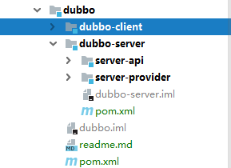
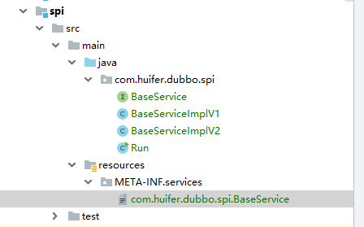
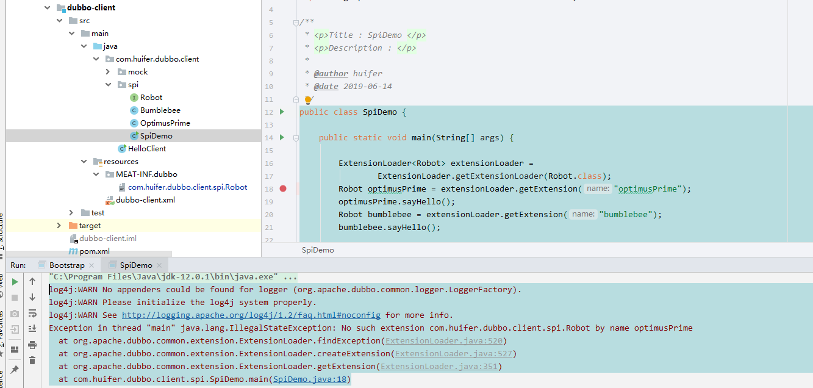
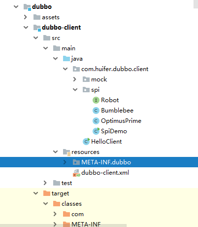
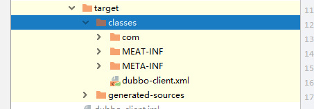
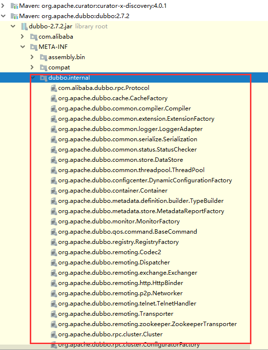
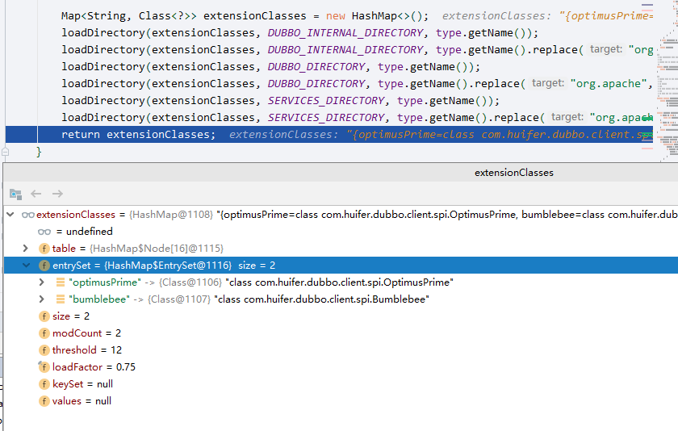

# dubbo 分布服务治理

## dubbo是什么

- 一个RPC框架


文档: <http://dubbo.apache.org/zh-cn/docs/user/quick-start.html>

## 简单案例

一般情况下dubbo分为如下几个模块

- dubbo-client: 客户端
- dubbo-server: 服务端
  - server-api:接口
  - server-provider: 接口实现
    - 依赖server-api 

项目结构如下



- server-api 接口

  ```java
  public interface DubboHello {
      String hello(String msg);
  } 
  ```

- server-provider接口实现

  ```java
  public class DubboHelloImpl implements DubboHello {
  
      @Override
      public String hello(String msg) {
          return "dubbo : " + msg;
      }
  
  }
  ```

- dubbo-client客户端

  ```java
  public class HelloClient {
  
      public static void main(String[] args) {
          DubboHello dubboHello = null;
          String helloDubbo = dubboHello.hello("hello dubbo");
          System.out.println(helloDubbo);
      }
  
  }
  ```

  - 这样是没办法进行方法调用，此时client依赖`server-api` ，还需要进行服务注册


### 改进

- server-provider 添加dubbo依赖

  ```xml
  <properties>
      <dubbo.version>2.7.2</dubbo.version>
  </properties>
  <dependency>
    <groupId>org.apache.dubbo</groupId>
    <artifactId>dubbo</artifactId>
    <version>${dubbo.version}</version>
  </dependency>
  ```

- dubbo-server.xml

  ```xml
  <?xml version="1.0" encoding="UTF-8"?>
  <beans xmlns="http://www.springframework.org/schema/beans"
    xmlns:xsi="http://www.w3.org/2001/XMLSchema-instance"
    xmlns:dubbo="http://dubbo.apache.org/schema/dubbo"
    xsi:schemaLocation="http://www.springframework.org/schema/beans        http://www.springframework.org/schema/beans/spring-beans-4.3.xsd        http://dubbo.apache.org/schema/dubbo        http://dubbo.apache.org/schema/dubbo/dubbo.xsd">
  
    <!-- 提供方应用信息，用于计算依赖关系 -->
    <dubbo:application name="dubbo-server-provider" owner="hufier"/>
  
    <!-- 使用multicast广播注册中心暴露服务地址 -->
    <dubbo:registry address="N/A"/>
  
    <!-- 用dubbo协议在20880端口暴露服务 -->
    <dubbo:protocol name="dubbo" port="20880"/>
  
    <!-- 声明需要暴露的服务接口 -->
    <dubbo:service interface="com.huifer.dubbo.server.api.DubboHello" ref="dubboHello"/>
  
    <!-- 和本地bean一样实现服务 id=server:ref-->
    <bean id="dubboHello" class="com.huifer.dubbo.server.provider.DubboHelloImpl"/>
  
  </beans>
  ```

- Bootstrap

  ```java
  public class Bootstrap {
  
      public static void main(String[] args) throws IOException {
          ClassPathXmlApplicationContext context = new ClassPathXmlApplicationContext(
                  "dubbo-server.xml");
          context.start();
          System.in.read();
      }
  
  }
  ```

- 启动

  ```
   dubbo://0.0.0.0:20880/com.huifer.dubbo.server.api.DubboHello?anyhost=true&application=dubbo-server-provider&bean.name=com.huifer.dubbo.server.api.DubboHello&bind.ip=0.0.0.0&bind.port=20880&deprecated=false&dubbo=2.0.2&dynamic=true&generic=false&interface=com.huifer.dubbo.server.api.DubboHello&methods=hello&owner=hufier&pid=12916&register=true&release=2.7.2&side=provider&timestamp=1560395544486, dubbo version: 2.7.2, current host: 0.0.0.0
  ```

  

- `dubbo-client`也需要加入`dubbo`依赖

- dubbo-client.xml

  ```xml
  <?xml version="1.0" encoding="UTF-8"?>
  <beans xmlns="http://www.springframework.org/schema/beans"
    xmlns:xsi="http://www.w3.org/2001/XMLSchema-instance"
    xmlns:dubbo="http://dubbo.apache.org/schema/dubbo"
    xsi:schemaLocation="http://www.springframework.org/schema/beans        http://www.springframework.org/schema/beans/spring-beans-4.3.xsd        http://dubbo.apache.org/schema/dubbo        http://dubbo.apache.org/schema/dubbo/dubbo.xsd">
  
    <!-- 消费方应用名，用于计算依赖关系，不是匹配条件，不要与提供方一样 -->
    <dubbo:application name="dubbo-client"  />
  
    <!-- 使用multicast广播注册中心暴露发现服务地址 -->
    <dubbo:registry address="N/A" />
  
    <!-- 生成远程服务代理，可以和本地bean一样使用demoService -->
    <dubbo:reference id="dubboHello" interface="com.huifer.dubbo.server.api.DubboHello" url="dubbo://0.0.0.0:20880/com.huifer.dubbo.server.api.DubboHello"/>
  </beans>
  ```

- HelloClient

  ```java
  public class HelloClient {
  
      public static void main(String[] args) {
          ClassPathXmlApplicationContext context = new ClassPathXmlApplicationContext(
                  "dubbo-client.xml");
          DubboHello dubboHello = (DubboHello) context.getBean("dubboHello");
  
          String helloDubbo = dubboHello.hello("hello dubbo");
          System.out.println(helloDubbo);
      }
  
  }
  ```

  - 运行结果

    `dubbo : hello dubbo`

### 配合zk

- 依赖

  ```xml
  <dependency>
    <groupId>org.apache.dubbo</groupId>
    <artifactId>dubbo</artifactId>
    <version>${dubbo.version}</version>
  </dependency>
  
  <dependency>
    <groupId>org.apache.dubbo</groupId>
    <artifactId>dubbo-dependencies-zookeeper</artifactId>
    <version>${dubbo.version}</version>
  </dependency>
  ```

- 服务端地址配置

```xml
<?xml version="1.0" encoding="UTF-8"?>
<beans xmlns="http://www.springframework.org/schema/beans"
  xmlns:xsi="http://www.w3.org/2001/XMLSchema-instance"
  xmlns:dubbo="http://dubbo.apache.org/schema/dubbo"
  xsi:schemaLocation="http://www.springframework.org/schema/beans        http://www.springframework.org/schema/beans/spring-beans-4.3.xsd        http://dubbo.apache.org/schema/dubbo        http://dubbo.apache.org/schema/dubbo/dubbo.xsd">

  <!-- 提供方应用信息，用于计算依赖关系 -->
  <dubbo:application name="dubbo-server-provider" owner="hufier"/>

  <dubbo:registry address="zookeeper://192.168.1.107:2181"/>
  <!-- 用dubbo协议在20880端口暴露服务 -->
  <dubbo:protocol name="dubbo" port="20880"/>

  <!-- 声明需要暴露的服务接口 -->
  <dubbo:service interface="com.huifer.dubbo.server.api.DubboHello" ref="dubboHello"/>

  <!-- 和本地bean一样实现服务 id=server:ref-->
  <bean id="dubboHello" class="com.huifer.dubbo.server.provider.DubboHelloImpl"/>

</beans>

```

- 客户端配置

  ```xml
  <?xml version="1.0" encoding="UTF-8"?>
  <beans xmlns="http://www.springframework.org/schema/beans"
    xmlns:xsi="http://www.w3.org/2001/XMLSchema-instance"
    xmlns:dubbo="http://dubbo.apache.org/schema/dubbo"
    xsi:schemaLocation="http://www.springframework.org/schema/beans        http://www.springframework.org/schema/beans/spring-beans-4.3.xsd        http://dubbo.apache.org/schema/dubbo        http://dubbo.apache.org/schema/dubbo/dubbo.xsd">
  
    <!-- 消费方应用名，用于计算依赖关系，不是匹配条件，不要与提供方一样 -->
    <dubbo:application name="dubbo-client"  />
  
    <dubbo:registry address="zookeeper://192.168.1.107:2181"/>
  
    <!-- 生成远程服务代理，可以和本地bean一样使用demoService -->
    <dubbo:reference id="dubboHello" interface="com.huifer.dubbo.server.api.DubboHello" />
  </beans>
  ```

  


## dubbo 在zookeeper

启动一个dubbo服务端项目在zookeeper的结构

- 启动一个dubbo服务端，内含包括

```xml
<?xml version="1.0" encoding="UTF-8"?>
<beans xmlns="http://www.springframework.org/schema/beans"
  xmlns:xsi="http://www.w3.org/2001/XMLSchema-instance"
  xmlns:dubbo="http://dubbo.apache.org/schema/dubbo"
  xsi:schemaLocation="http://www.springframework.org/schema/beans        http://www.springframework.org/schema/beans/spring-beans-4.3.xsd        http://dubbo.apache.org/schema/dubbo        http://dubbo.apache.org/schema/dubbo/dubbo.xsd">

  <!-- 提供方应用信息，用于计算依赖关系 -->
  <dubbo:application name="dubbo-server-provider" owner="hufier"/>

  <dubbo:registry address="zookeeper://192.168.1.107:2181"/>
  <!-- 用dubbo协议在20880端口暴露服务 -->
  <dubbo:protocol name="dubbo" port="20880"/>

  <!-- 声明需要暴露的服务接口 protocl可以填写多个协议 -->
  <dubbo:service interface="com.huifer.dubbo.server.api.DubboHello" ref="dubboHello" protocol="dubbo"/> 
  <dubbo:service interface="com.huifer.dubbo.server.api.DubboHello2" ref="dubboHello2" protocol="hessian"/>

  <!-- 和本地bean一样实现服务 id=server:ref-->
  <bean id="dubboHello" class="com.huifer.dubbo.server.provider.DubboHelloImpl"/>
  <bean id="dubboHello2" class="com.huifer.dubbo.server.provider.DubboHelloImpl2"/>

</beans>

```

- dubbo在zookeeper下的存放结构

```mermaid


graph TD;
/ --> /dubbo
/dubbo --> /DubboHello
/dubbo --> /DubboHello2
/DubboHello --> /providers
/providers --> 具体协议dubbo+接口
/providers --> 具体协议hessian+接口


```


## 多版本关键字version

- 定义接口

```java
public interface DubboVersion1 {

    /**
     * 第一个版本的hello
     * @param o
     * @return
     */
    String sayHelloV1(String o);

}
```

- 同一个接口2个版本实现

  ```java
  public class DubboV1 implements DubboVersion1 {
  
      @Override
      public String sayHelloV1(String o) {
          return "version1 : " + o;
      }
  }
  ```

  ```java
  public class DubboV2 implements DubboVersion1 {
  
      @Override
      public String sayHelloV1(String o) {
          return "version2 : " + o;
      }
  }
  ```

- 服务端配置

  ```xml
    <dubbo:service interface="com.huifer.dubbo.server.api.DubboVersion1" ref="dv1" protocol="dubbo"
      version="1.0.0"/>
    <dubbo:service interface="com.huifer.dubbo.server.api.DubboVersion1" ref="dv2" protocol="dubbo"
      version="2.0.0"/>
  
  
    <bean id="dv1" class="com.huifer.dubbo.server.provider.DubboV1" />
    <bean id="dv2" class="com.huifer.dubbo.server.provider.DubboV2"/>
  
  
  ```

- 客户端配置

  ```xml
  <dubbo:reference id="acac" interface="com.huifer.dubbo.server.api.DubboHello" version="1.0.0"/>
  ```

- 客户端代码

  ```java
  public class HelloClient {
  
      public static void main(String[] args) {
          ClassPathXmlApplicationContext context = new ClassPathXmlApplicationContext(
                  "dubbo-client.xml");
  
  
          DubboVersion1 dv1 = (DubboVersion1) context.getBean("acac");
          System.out.println(dv1.sayHelloV1("hello-dubbo"));
      }
  
  }
  ```

- 想要替换成`version=2.0.0`只需要将 客户端配置中`version`进行修改即可

- zookeeper变化

  - 在这个路径中存放了`version=xxx`

  ```
  [dubbo%3A%2F%2F0.0.0.0%3A20880%2Fcom.huifer.dubbo.server.api.DubboVersion1%3Fanyhost%3Dtrue%26application%3Ddubbo-server-provider%26bean.name%3Dcom.huifer.dubbo.server.api.DubboVersion1%26deprecated%3Dfalse%26dubbo%3D2.0.2%26dynamic%3Dtrue%26generic%3Dfalse%26interface%3Dcom.huifer.dubbo.server.api.DubboVersion1%26methods%3DsayHelloV1%26owner%3Dhufier%26pid%3D10848%26register%3Dtrue%26release%3D2.7.2%26revision%3D1.0.0%26side%3Dprovider%26timestamp%3D1560473277839%26version%3D1.0.0, dubbo%3A%2F%2F0.0.0.0%3A20880%2Fcom.huifer.dubbo.server.api.DubboVersion12%3Fanyhost%3Dtrue%26application%3Ddubbo-server-provider%26bean.name%3Dcom.huifer.dubbo.server.api.DubboVersion12%26deprecated%3Dfalse%26dubbo%3D2.0.2%26dynamic%3Dtrue%26generic%3Dfalse%26interface%3Dcom.huifer.dubbo.server.api.DubboVersion1%26methods%3DsayHelloV1%26owner%3Dhufier%26pid%3D10848%26register%3Dtrue%26release%3D2.7.2%26revision%3D2.0.0%26side%3Dprovider%26timestamp%3D1560473277917%26version%3D2.0.0]
  
  ```

## 容错机制 cluster关键字 

```xml
<dubbo:reference id="acac"
  interface="com.huifer.dubbo.server.api.DubboVersion1"
  version="2.0.0"
  cluster="failsafe"
/>
```

`org.apache.dubbo.rpc.cluster.support`包下

- failsafe
  - 请求失败，记录请求，
- **failover**
  - 默认
  - 请求失败重试其他服务器
  - 重试次数：2 ，不包含第一次请求，总共发送3次请求
  - 搜索查询推荐使用
- **failfast**
  - 快速失败，失败直接报错
  - 数据操作增加、删除、修改推荐使用
- **failback**
  - 失败后恢复
  - 数据操作增加、删除、修改推荐使用
- forking
  - 同时调用N个节点(由forks设置),多个节点谁先返回就返回这个结果
  - forks：最大并行数量
- broadcast
  - 广播，只要由一台服务报错执行就报错

## 配置

| 标签                                                         | 用途         | 解释                                                         |
| ------------------------------------------------------------ | ------------ | ------------------------------------------------------------ |
| `<dubbo:service/>`                                           | 服务配置     | 用于暴露一个服务，定义服务的元信息，一个服务可以用多个协议暴露，一个服务也可以注册到多个注册中心 |
| `<dubbo:reference/>`[[2\]](http://dubbo.apache.org/zh-cn/docs/user/configuration/xml.html#fn2) | 引用配置     | 用于创建一个远程服务代理，一个引用可以指向多个注册中心       |
| `<dubbo:protocol/>`                                          | 协议配置     | 用于配置提供服务的协议信息，协议由提供方指定，消费方被动接受 |
| `<dubbo:application/>`                                       | 应用配置     | 用于配置当前应用信息，不管该应用是提供者还是消费者           |
| `<dubbo:module/>`                                            | 模块配置     | 用于配置当前模块信息，可选                                   |
| `<dubbo:registry/>`                                          | 注册中心配置 | 用于配置连接注册中心相关信息                                 |
| `<dubbo:monitor/>`                                           | 监控中心配置 | 用于配置连接监控中心相关信息，可选                           |
| `<dubbo:provider/>`                                          | 提供方配置   | 当 ProtocolConfig 和 ServiceConfig 某属性没有配置时，采用此缺省值，可选 |
| `<dubbo:consumer/>`                                          | 消费方配置   | 当 ReferenceConfig 某属性没有配置时，采用此缺省值，可选      |
| `<dubbo:method/>`                                            | 方法配置     | 用于 ServiceConfig 和 ReferenceConfig 指定方法级的配置信息   |
| `<dubbo:argument/>`                                          | 参数配置     | 用于指定方法参数配置                                         |

## 配置优先级

官方文档-配置<http://dubbo.apache.org/zh-cn/docs/user/configuration/xml.html>


1. **客户端>服务端**

2. **方法>接口>全局配置**
1. 同级别客户端优先


## 服务降级

**mock 客户端配置**

- 定义mock类

  ```java
  public class MockDemo implements DubboVersion1 {
  
      @Override
      public String sayHelloV1(String o) {
          return "服务降级-mock" + o;
      }
  }
  ```

- 客户端配置

  1毫秒完成调用

  ```java
    <dubbo:reference id="acac"
      interface="com.huifer.dubbo.server.api.DubboVersion1"
      version="2.0.0"
      timeout="1"
      mock="com.huifer.dubbo.client.mock.MockDemo"
  
    />
  ```

  ```java
  public class HelloClient {
  
      public static void main(String[] args) {
          ClassPathXmlApplicationContext context = new ClassPathXmlApplicationContext(
                  "dubbo-client.xml");
          DubboVersion1 dv1 = (DubboVersion1) context.getBean("acac");
          System.out.println(dv1.sayHelloV1("hello-dubbo"));
      }
  
  }
  ```

- 运行结果

  ```
  服务降级-mock : hello-dubbo
  ```

  


## SPI

### Java SPI

```sequence
调用者-->BaseService:调用
BaseService --> BaseServiceImpl1:发现
BaseService --> BaseServiceImpl2:发现
```


- 基本接口

  ```java
  public interface BaseService {
      String hello(String msg);
  }
  ```

- 实现1

  ```java
  public class BaseServiceImplV1 implements BaseService {
  
      @Override
      public String hello(String msg) {
          return "v1 : " + msg;
      }
  }
  ```

- 实现2

  ```java
  public class BaseServiceImplV2 implements BaseService {
  
      @Override
      public String hello(String msg) {
          return "v2 : " + msg;
      }
  }
  ```

- 配置文件

  `src/main/resources/`下创建` /META-INF/services`，并且以接口全类名创建文件，填写内容为实现该类的实现类的全类名

  - `com.huifer.dubbo.spi.BaseService`

    ```
    com.huifer.dubbo.spi.BaseServiceImplV1
    com.huifer.dubbo.spi.BaseServiceImplV2
    
    ```

    


- 启动

  ```java
  public class Run {
  
      public static void main(String[] args) {
          ServiceLoader<BaseService> baseServices = ServiceLoader.load(BaseService.class);
  
          for (BaseService baseService : baseServices) {
              System.out.println(baseService.hello("fff"));;
          }
      }
  
  }
  ```
  - 运行结果

    ```
    v1 : fff
    v2 : fff
    ```

    


### dubbo SPI

#### demo

官方文档 <http://dubbo.apache.org/zh-cn/docs/source_code_guide/dubbo-spi.html>

- dubbo中spi资源应该放在那里？
  - /META-INF/dubbo下
- 文件编写
  - 文件名: 全路径类名
  - 内容 key=value


- 接口

  ```java
  @SPI
  public interface Robot {
      void sayHello();
  }
  ```

- 接口实现1

  ```java
  public class Bumblebee implements Robot {
  
      @Override
      public void sayHello() {
          System.out.println("Hello, I am Bumblebee.");
      }
  }
  ```

- 接口实现2

  ```java
  public class OptimusPrime implements Robot {
  
      @Override
      public void sayHello() {
          System.out.println("Hello, I am Optimus Prime.");
      }
  }
  ```

- 配置文件

  ```
  optimusPrime=com.huifer.dubbo.client.spi.OptimusPrime
  bumblebee=com.huifer.dubbo.client.spi.Bumblebee
  ```

- 启动器

  ```java
  public class SpiDemo {
  
      public static void main(String[] args) {
  
          ExtensionLoader<Robot> extensionLoader =
                  ExtensionLoader.getExtensionLoader(Robot.class);
          Robot optimusPrime = extensionLoader.getExtension("optimusPrime");
          optimusPrime.sayHello();
          Robot bumblebee = extensionLoader.getExtension("bumblebee");
          bumblebee.sayHello();
  
      }
  
  }
  ```

  - 下图为一个错误的拼写



- 正确拼写
  - 

相关issues: <https://github.com/apache/dubbo/issues/4310> 问题在单词拼写 :cry:

##### 检查流程

- 打开target文件夹下查看编译后结果

  

  然后就知道问题了!!!!!!!!

  

#### org.apache.dubbo.common.extension.ExtensionLoader 类

> 调用链
>
> - `org.apache.dubbo.common.extension.ExtensionLoader#getExtensionLoader`
>   - `org.apache.dubbo.common.extension.ExtensionLoader#getAdaptiveExtension`
>     - `org.apache.dubbo.common.extension.ExtensionLoader#createAdaptiveExtension`
>       - `org.apache.dubbo.common.extension.ExtensionLoader#getAdaptiveExtensionClass`
>         - `org.apache.dubbo.common.extension.ExtensionLoader#getExtensionClasses`
>           - `org.apache.dubbo.common.extension.ExtensionLoader#loadExtensionClasses`
>             - `org.apache.dubbo.common.extension.ExtensionLoader#cacheDefaultExtensionName`
>         - `org.apache.dubbo.common.extension.ExtensionLoader#createAdaptiveExtensionClass`


- `org.apache.dubbo.common.extension.ExtensionLoader#getExtensionLoader`

  - 作用: 传入一个class 来获得 `ExtensionLoader`

  ```java
  @SuppressWarnings("unchecked")
  public static <T> ExtensionLoader<T> getExtensionLoader(Class<T> type) {
      if (type == null) {
          throw new IllegalArgumentException("Extension type == null");
      }
      if (!type.isInterface()) {
          throw new IllegalArgumentException("Extension type (" + type + ") is not an interface!");
      }
      if (!withExtensionAnnotation(type)) {
          throw new IllegalArgumentException("Extension type (" + type +
                  ") is not an extension, because it is NOT annotated with @" + SPI.class.getSimpleName() + "!");
      }
  	// 从EXTENSION_LOADERS中获取 这是个Map<Class,ExtensionLoader>
      ExtensionLoader<T> loader = (ExtensionLoader<T>) EXTENSION_LOADERS.get(type);
      if (loader == null) {
          // 创建一个 ExtensionLoader
          EXTENSION_LOADERS.putIfAbsent(type, new ExtensionLoader<T>(type));
          loader = (ExtensionLoader<T>) EXTENSION_LOADERS.get(type);
      }
      return loader;
  }
  ```

- 继续debug进入到了`org.apache.dubbo.common.extension.ExtensionLoader#getAdaptiveExtension`方法

  - 将instance 创建到内存中

  ```java
  @SuppressWarnings("unchecked")
  public T getAdaptiveExtension() {
      Object instance = cachedAdaptiveInstance.get();
      if (instance == null) {
          if (createAdaptiveInstanceError == null) {
              synchronized (cachedAdaptiveInstance) {
                  instance = cachedAdaptiveInstance.get();
                  if (instance == null) {
                      try {
                          // 将 instance 放入cachedAdaptiveInstance
                          instance = createAdaptiveExtension();
                          cachedAdaptiveInstance.set(instance);
                      } catch (Throwable t) {
                          createAdaptiveInstanceError = t;
                          throw new IllegalStateException("Failed to create adaptive instance: " + t.toString(), t);
                      }
                  }
              }
          } else {
              throw new IllegalStateException("Failed to create adaptive instance: " + createAdaptiveInstanceError.toString(), createAdaptiveInstanceError);
          }
      }
  
      return (T) instance;
  }
  ```

- `createAdaptiveExtension()`

  ```java
  @SuppressWarnings("unchecked")
  private T createAdaptiveExtension() {
      try {
          // 获得一个适配器实例
          return injectExtension((T) getAdaptiveExtensionClass().newInstance());
      } catch (Exception e) {
          throw new IllegalStateException("Can't create adaptive extension " + type + ", cause: " + e.getMessage(), e);
      }
  }
  ```

- `getAdaptiveExtensionClass()`

  ```java
  private Class<?> getAdaptiveExtensionClass() {
      getExtensionClasses();
      if (cachedAdaptiveClass != null) {
          return cachedAdaptiveClass;
      }
      return cachedAdaptiveClass = createAdaptiveExtensionClass();
  }
  ```

- `getExtensionClasses`

  - 获取所有扩展类 `Holder<Map<String, Class<?>>> cachedClasses`

  ```java
  private Map<String, Class<?>> getExtensionClasses() {
      Map<String, Class<?>> classes = cachedClasses.get();
      if (classes == null) {
          synchronized (cachedClasses) {
              classes = cachedClasses.get();
              if (classes == null) {
                  classes = loadExtensionClasses();
                  cachedClasses.set(classes);
              }
          }
      }
      return classes;
  }
  ```

- `loadExtensionClasses`

  加载dubbo预设扩展点

  ```java
  private Map<String, Class<?>> loadExtensionClasses() {
      cacheDefaultExtensionName();
  
      Map<String, Class<?>> extensionClasses = new HashMap<>();
      loadDirectory(extensionClasses, DUBBO_INTERNAL_DIRECTORY, type.getName());
      loadDirectory(extensionClasses, DUBBO_INTERNAL_DIRECTORY, type.getName().replace("org.apache", "com.alibaba"));
      loadDirectory(extensionClasses, DUBBO_DIRECTORY, type.getName());
      loadDirectory(extensionClasses, DUBBO_DIRECTORY, type.getName().replace("org.apache", "com.alibaba"));
      loadDirectory(extensionClasses, SERVICES_DIRECTORY, type.getName());
      loadDirectory(extensionClasses, SERVICES_DIRECTORY, type.getName().replace("org.apache", "com.alibaba"));
      return extensionClasses;
  }
  ```

  ```java
  private static final String SERVICES_DIRECTORY = "META-INF/services/";
  
  private static final String DUBBO_DIRECTORY = "META-INF/dubbo/";
  
  private static final String DUBBO_INTERNAL_DIRECTORY = DUBBO_DIRECTORY + "internal/";
  ```

  

  这些内容会被加载，当然项目中的也会被加载

  


- `cacheDefaultExtensionName`

- `createAdaptiveExtensionClass`

  - 创建扩展点

  ```java
  private Class<?> createAdaptiveExtensionClass() {
      String code = new AdaptiveClassCodeGenerator(type, cachedDefaultName).generate();
      ClassLoader classLoader = findClassLoader();
      org.apache.dubbo.common.compiler.Compiler compiler = ExtensionLoader.getExtensionLoader(org.apache.dubbo.common.compiler.Compiler.class).getAdaptiveExtension();
      return compiler.compile(code, classLoader);
  }
  ```

---

