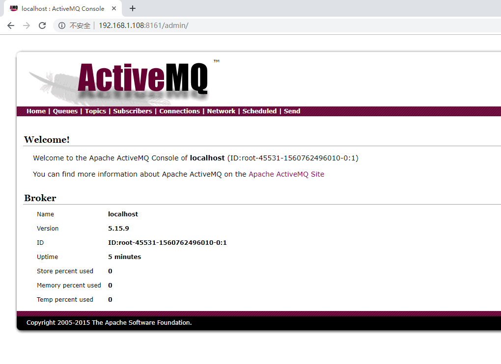

# activemq
## 安装
官网下载: http://activemq.apache.org/components/classic/download/

```shell
tar -zxvf apache-activemq-5.15.9-bin.tar.gz apache-activemq-5.15.9/
cd bin
sh activemq start

```

- 访问监控平台

  <http://192.168.1.108:8161/>

- 账号密码设置

  `vim conf/jetty.xml`

  ```xml
  <bean id="adminSecurityConstraint" class="org.eclipse.jetty.util.security.Constraint">
      <property name="name" value="BASIC" />
      <property name="roles" value="admin" />
       <!-- set authenticate=false to disable login -->
      <property name="authenticate" value="true" />
  </bean>
  ```

  将`authenticate`属性修改为`true`

  - `vim conf/jetty-realm.properties `

    ```properties
    # Defines users that can access the web (console, demo, etc.)
    # username: password [,rolename ...]
    admin: admin, admin
    user: user, user
    
    ```

    - 密码为admin，admin

- 访问

  


## Java Message Service（JMS）

> 
>
> JMS即[Java消息服务](https://baike.baidu.com/item/Java消息服务)（Java Message Service）应用程序接口，是一个[Java平台](https://baike.baidu.com/item/Java平台)中关于面向[消息中间件](https://baike.baidu.com/item/消息中间件/5899771)（MOM）的[API](https://baike.baidu.com/item/API/10154)，用于在两个应用程序之间，或[分布式系统](https://baike.baidu.com/item/分布式系统/4905336)中发送消息，进行异步通信。Java消息服务是一个与具体平台无关的API，绝大多数MOM提供商都对JMS提供支持。
>
> JMS是一种与厂商无关的 API，用来访问收发系统消息，它类似于[JDBC](https://baike.baidu.com/item/JDBC)(Java Database Connectivity)。这里，JDBC 是可以用来访问许多不同关系数据库的 API，而 JMS 则提供同样与厂商无关的访问方法，以访问消息收发服务。许多厂商都支持 JMS，包括 IBM 的 MQSeries、BEA的 Weblogic JMS service和 Progress 的 SonicMQ。 JMS 使您能够通过消息收发服务（有时称为消息中介程序或路由器）从一个 JMS 客户机向另一个 JMS客户机发送消息。消息是 JMS 中的一种类型对象，由两部分组成：报头和消息主体。报头由路由信息以及有关该消息的元数据组成。消息主体则携带着应用程序的数据或有效负载。根据有效负载的类型来划分，可以将消息分为几种类型，它们分别携带：简单文本(TextMessage)、可序列化的对象 (ObjectMessage)、属性集合 (MapMessage)、字节流 (BytesMessage)、原始值流 (StreamMessage)，还有无有效负载的消息 (Message)。
>
> 链接地址：<https://baike.baidu.com/item/JMS/2836691?fr=aladdin>


- jms是一个API

[**JMS规范**](<http://doc.yonyoucloud.com/doc/JMS2CN/index.html>)


## 案例

- 依赖


