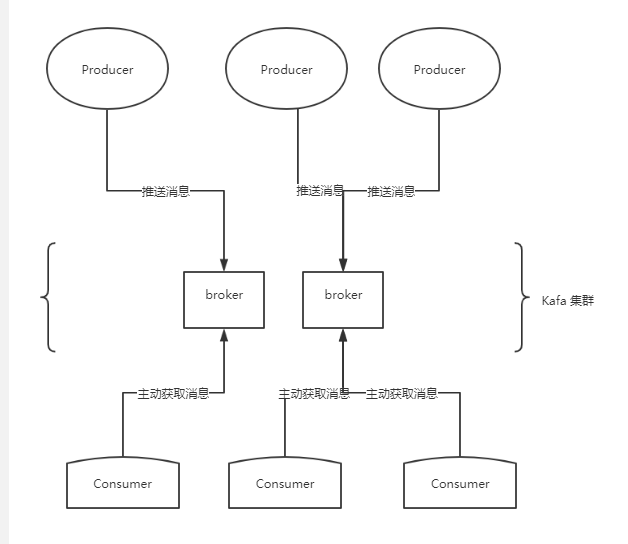
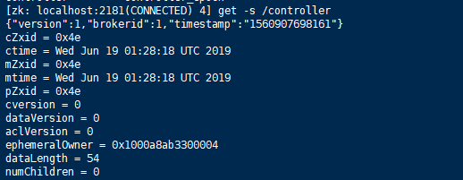
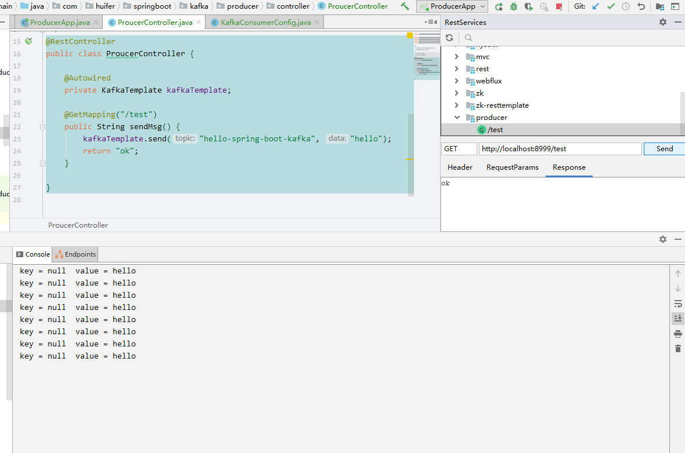
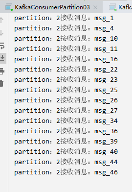
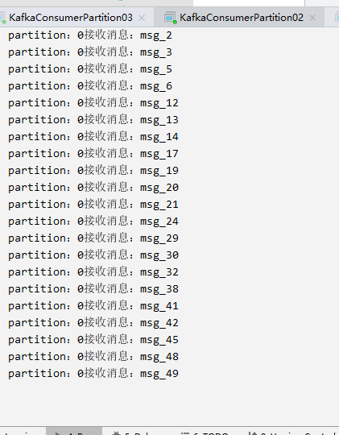
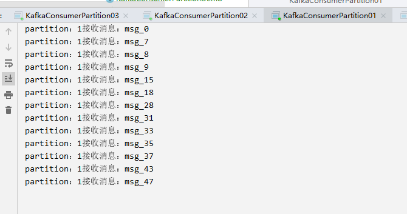
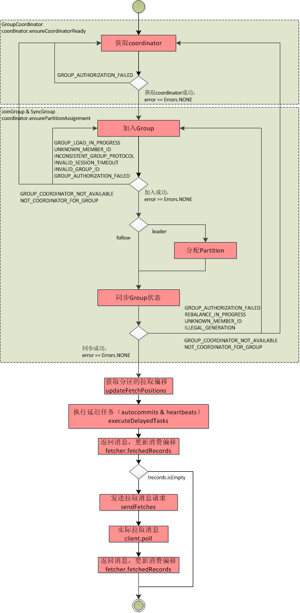
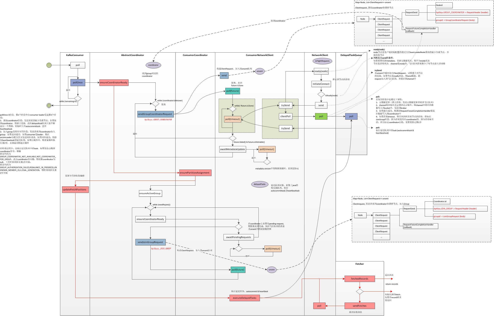
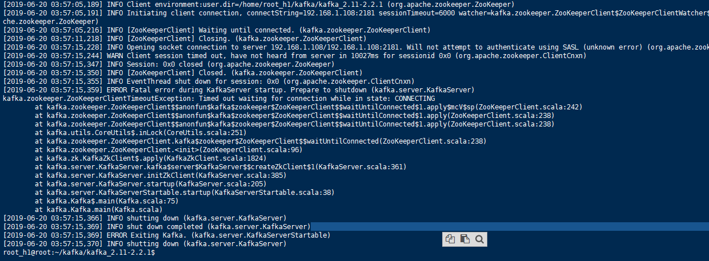

# kafka

## Kafka特性

1. 消息持久化
2. 高吞吐量
3. 扩展性
4. 多客户端支持
5. 流处理Kafka Streams
6. 安全机制
   1. SSL & SASL 
   2. zookeeper连接身份校验
   3. 通讯时数据加密
   4. 客户端读写权限认证
7. 数据备份
8. 轻量级

## 基础模型





## 安装

- 安装包下载

```shell
wget http://mirror.bit.edu.cn/apache/kafka/2.2.1/kafka_2.11-2.2.1.tgz 
tar -xvzf kafka_2.11-2.2.1.tgz      
```

- 修改配置暂时只需要修改zookeeper.connect

  ```shell
  vim config/server.properties 
  ```

  ```
  zookeeper.connect=192.168.1.215:2181
  ```

  

- 启动

  ```shell
  bin/kafka-server-start.sh config/server.properties  
  ```

- 创建 topic

  ```shell
  bin/kafka-topics.sh --create --bootstrap-server localhost:9092 --replication-factor 1 --partitions 1 --topic test
  ```

- 查看topic

  ```shell
  bin/kafka-topics.sh --list --bootstrap-server localhost:9092
  ```

- 发消息

  ```shell
  bin/kafka-console-producer.sh --broker-list localhost:9092 --topic test
  ```

- 客户端接收消息

  ```shell
  bin/kafka-console-consumer.sh --bootstrap-server localhost:9092 --topic test --from-beginning
  ```

## 集群搭建

- 注册到同一个zookeeper上，修改`server.properties`，zookeeper如果是集群使用逗号(`,`)分割

  ```properties
  zookeeper.connect=192.168.1.108:2181 #填写zookeeper地址
  broker.id=2 # 集群中唯一
  listeners=PLAINTEXT://192.168.1.108:9092# 填写本机ip地址
  ```

  启动

  ` bin/kafka-server-start.sh -daemon config/server.properties `

  

  - leader选举最早启动的`brokerid=1`

    


##  KafkaOffsetMonitor

> **KafkaOffsetMonitor** 是有由Kafka开源社区提供的一款Web管理界面，这个应用程序用来实时监控Kafka服务的Consumer以及它们所在的Partition中的Offset，可以浏览当前的消费者组，查看每个Topic的所有Partition的当前消费情况，浏览查阅Topic的历史消费信息等

github：<https://github.com/quantifind/KafkaOffsetMonitor>

```shell
java -cp KafkaOffsetMonitor-assembly-0.2.1.jar \
     com.quantifind.kafka.offsetapp.OffsetGetterWeb \
     --offsetStorage kafka
     --zk zk-server1,zk-server2 \
     --port 8080 \
     --refresh 10.seconds \
     --retain 2.days
```

参数说明

- **offsetStorage** ：在`zookeeper`, `kafka` , `storm`选择
- **zk**：zookeeper主机地址，多个地址用逗号(`,`)分割
- **port**：启动后占用端口
- **refresh**：应用程序在数据库中刷新和存储点的频率 
- **retain**： 在db中保留多长时间 
- **dbName** ：数据库名称 ，默认`offsetapp`

### 脚本编写

```shell
#! /bin/bash
java -Xms128M -Xmx256M -Xss1024K -XX:PermSize=128m -XX:MaxPermSize=256m -cp ./KafkaOffsetMonitor-assembly-0.2.1.jar com.quantifind.kafka.offsetapp.OffsetGetterWeb --zk 127.0.0.1:2181 --port 8086 --refresh 10.seconds --retain 2.days 1> kakfa.offset.monitor.logs.stdout.log 2>kafka.offset.monitor.logs.stderr.log &

```


## 术语

### 消息生产者produce

> 英文：produce，消息的产生源头，负责生产消息并发送给Kafka

### 消息消费者Consumer

> 英文：Consumer，消息的使用方，负责消费Kafka服务器上的消息

### 主题Topic

> 英文：Topic，由用户定义并配置Kafka服务器，用于建立生产者和消息者之间的订阅关系。

### 订阅关系

> 生产者发送消息到指定的主题(Topic)，消息消费者从这个主题(Topic)下消费消息(获取)

### 消息分区Partition

> 英文：Partition，一个Topic下分多个分区。

### Broker

> Kafka的服务器，用户存储消息，Kafka集群中的一台或堕胎服务器统称Broker

### 消费者分组Group

> 英文：Group，用户归组同类消费者，在Kafka中，多个消费者可以消费共同一个主题(Topic)下的消息，每个消费者消费其中的消息，这些消费者组成一个分组，并且拥有一个分组名称。

### Offset

> 消息存储在Kafka的Broker上，消费者拉取消息数据的过程需要直到消息在文件中的偏移量。


### 消息头

#### v0

| crc   | 版本号 | 属性  | key长度 | key   | value长度 | value   |
| ----- | ------ | ----- | ------- | ----- | --------- | ------- |
| 4子节 | 1子节  | 1子节 | 4子节   | key值 | 4子节     | value值 |

#### v1

| crc   | 版本号 | 属性  | 时间戳 | key长度 | key   | value长度 | value   |
| ----- | ------ | ----- | ------ | ------- | ----- | --------- | ------- |
| 4子节 | 1子节  | 1子节 | 8子节  | 4子节   | key值 | 4子节     | value值 |

#### v2

| 消息总长 | 属性  | 时间戳   | 位移增量 | key长度  | key   | value长度 | value   | header个数 | headers  |
| -------- | ----- | -------- | -------- | -------- | ----- | --------- | ------- | ---------- | -------- |
| 可变长度 | 1子节 | 可变长度 | 可变长度 | 可变长度 | key值 | 可变长度  | value值 | 可变长度   | header值 |

Zig-zag算法


## 依赖

```xml
<dependency>
  <groupId>org.apache.kafka</groupId>
  <artifactId>kafka-clients</artifactId>
  <version>1.0.0</version>
</dependency>
```

## Kafka简单案例

- 两种初始化方式均需要传入一个配置

```java
public KafkaProducer(Map<String, Object> configs) {
    this((ProducerConfig)(new ProducerConfig(configs)), (Serializer)null, (Serializer)null);
}
```

```java
public KafkaProducer(Properties properties) {
    this(new ProducerConfig(properties), null, null);
}
```

- 配置相关`org.apache.kafka.clients.producer.ProducerConfig`

  相关文档:<http://kafka.apache.org/documentation.html#producerconfigs>

- 服务发送端

```java
public class KafkaProducerDemo extends Thread {

    private final KafkaProducer<Integer, String> producer;
    private final String topic;

    public KafkaProducerDemo(
            KafkaProducer<Integer, String> producer, String topic) {
        this.producer = producer;
        this.topic = topic;
    }

    public static void main(String[] args) {
        Properties properties = new Properties();
        // 连接到那一台kafka 可以填写多个用","分割
        properties.put(ProducerConfig.BOOTSTRAP_SERVERS_CONFIG, "192.168.57.1:9092");
        properties.put(ProducerConfig.CLIENT_ID_CONFIG, "KafkaProducerDemo-java");
        properties.put(ProducerConfig.ACKS_CONFIG, "-1");
        properties.put(ProducerConfig.KEY_SERIALIZER_CLASS_CONFIG,
                "org.apache.kafka.common.serialization.IntegerSerializer");// 序列化手段
        properties.put(ProducerConfig.VALUE_SERIALIZER_CLASS_CONFIG,
                "org.apache.kafka.common.serialization.StringSerializer");// 序列化手段
        KafkaProducer<Integer, String> producer = new KafkaProducer<Integer, String>(properties);

        KafkaProducerDemo test = new KafkaProducerDemo(producer, "test");
        test.start();

    }

    @Override
    public void run() {
        int n = 0;
        while (n < 50) {
            String msg = "msg_" + n;
            n++;

            producer.send(new ProducerRecord<Integer, String>(topic, msg));
            try {
                Thread.sleep(100);
            } catch (InterruptedException e) {
                e.printStackTrace();
            }
        }

    }
}
```


- 服务消费端

  ```java
  public class KafkaConsumerDemo extends Thread {
  
      private final KafkaConsumer kafkaConsumer;
      private final String topic;
      public KafkaConsumerDemo(String topic) {
          Properties properties = new Properties();
          properties.put(ConsumerConfig.BOOTSTRAP_SERVERS_CONFIG, "192.168.57.1:9092");
          properties.put(ConsumerConfig.GROUP_ID_CONFIG, "KafkaConsumerDemo-java");
          properties.put(ConsumerConfig.ENABLE_AUTO_COMMIT_CONFIG, "true");
          properties.put(ConsumerConfig.AUTO_COMMIT_INTERVAL_MS_CONFIG, "1000");
          properties.put(ConsumerConfig.KEY_DESERIALIZER_CLASS_CONFIG,
                  "org.apache.kafka.common.serialization.IntegerDeserializer");
          properties.put(ConsumerConfig.VALUE_DESERIALIZER_CLASS_CONFIG,
                  "org.apache.kafka.common.serialization.StringDeserializer");
  
          kafkaConsumer = new KafkaConsumer<>(properties);
          kafkaConsumer.subscribe(Collections.singletonList(topic));
          this.topic = topic;
      }
  
      public static void main(String[] args) {
          new KafkaConsumerDemo("test").start();
      }
  
      @Override
      public void run() {
          while (true) {
              ConsumerRecords<Integer, String> poll = kafkaConsumer.poll(1000);
              for (ConsumerRecord<Integer, String> record : poll) {
                  System.out.println("接收消息：" + record.value());
              }
  
          }
      }
  
  }
  ```


## 生产者

### 生产者配置 `ProducerConfig`

- `org.apache.kafka.clients.producer.ProducerConfig`
- 相关文档:<http://kafka.apache.org/documentation.html#producerconfigs>

- 默认配置

```java
static {
    CONFIG = new ConfigDef().define(BOOTSTRAP_SERVERS_CONFIG, Type.LIST, Importance.HIGH, CommonClientConfigs.BOOTSTRAP_SERVERS_DOC)
                            .define(BUFFER_MEMORY_CONFIG, Type.LONG, 32 * 1024 * 1024L, atLeast(0L), Importance.HIGH, BUFFER_MEMORY_DOC)
                            .define(RETRIES_CONFIG, Type.INT, 0, between(0, Integer.MAX_VALUE), Importance.HIGH, RETRIES_DOC)
                            .define(ACKS_CONFIG,
                                    Type.STRING,
                                    "1",
                                    in("all", "-1", "0", "1"),
                                    Importance.HIGH,
                                    ACKS_DOC)
                            .define(COMPRESSION_TYPE_CONFIG, Type.STRING, "none", Importance.HIGH, COMPRESSION_TYPE_DOC)
                            .define(BATCH_SIZE_CONFIG, Type.INT, 16384, atLeast(0), Importance.MEDIUM, BATCH_SIZE_DOC)
                            .define(LINGER_MS_CONFIG, Type.LONG, 0, atLeast(0L), Importance.MEDIUM, LINGER_MS_DOC)
                            .define(CLIENT_ID_CONFIG, Type.STRING, "", Importance.MEDIUM, CommonClientConfigs.CLIENT_ID_DOC)
                            .define(SEND_BUFFER_CONFIG, Type.INT, 128 * 1024, atLeast(-1), Importance.MEDIUM, CommonClientConfigs.SEND_BUFFER_DOC)
                            .define(RECEIVE_BUFFER_CONFIG, Type.INT, 32 * 1024, atLeast(-1), Importance.MEDIUM, CommonClientConfigs.RECEIVE_BUFFER_DOC)
                            .define(MAX_REQUEST_SIZE_CONFIG,
                                    Type.INT,
                                    1 * 1024 * 1024,
                                    atLeast(0),
                                    Importance.MEDIUM,
                                    MAX_REQUEST_SIZE_DOC)
                            .define(RECONNECT_BACKOFF_MS_CONFIG, Type.LONG, 50L, atLeast(0L), Importance.LOW, CommonClientConfigs.RECONNECT_BACKOFF_MS_DOC)
                            .define(RECONNECT_BACKOFF_MAX_MS_CONFIG, Type.LONG, 1000L, atLeast(0L), Importance.LOW, CommonClientConfigs.RECONNECT_BACKOFF_MAX_MS_DOC)
                            .define(RETRY_BACKOFF_MS_CONFIG, Type.LONG, 100L, atLeast(0L), Importance.LOW, CommonClientConfigs.RETRY_BACKOFF_MS_DOC)
                            .define(MAX_BLOCK_MS_CONFIG,
                                    Type.LONG,
                                    60 * 1000,
                                    atLeast(0),
                                    Importance.MEDIUM,
                                    MAX_BLOCK_MS_DOC)
                            .define(REQUEST_TIMEOUT_MS_CONFIG,
                                    Type.INT,
                                    30 * 1000,
                                    atLeast(0),
                                    Importance.MEDIUM,
                                    REQUEST_TIMEOUT_MS_DOC)
                            .define(METADATA_MAX_AGE_CONFIG, Type.LONG, 5 * 60 * 1000, atLeast(0), Importance.LOW, METADATA_MAX_AGE_DOC)
                            .define(METRICS_SAMPLE_WINDOW_MS_CONFIG,
                                    Type.LONG,
                                    30000,
                                    atLeast(0),
                                    Importance.LOW,
                                    CommonClientConfigs.METRICS_SAMPLE_WINDOW_MS_DOC)
                            .define(METRICS_NUM_SAMPLES_CONFIG, Type.INT, 2, atLeast(1), Importance.LOW, CommonClientConfigs.METRICS_NUM_SAMPLES_DOC)
                            .define(METRICS_RECORDING_LEVEL_CONFIG,
                                    Type.STRING,
                                    Sensor.RecordingLevel.INFO.toString(),
                                    in(Sensor.RecordingLevel.INFO.toString(), Sensor.RecordingLevel.DEBUG.toString()),
                                    Importance.LOW,
                                    CommonClientConfigs.METRICS_RECORDING_LEVEL_DOC)
                            .define(METRIC_REPORTER_CLASSES_CONFIG,
                                    Type.LIST,
                                    "",
                                    Importance.LOW,
                                    CommonClientConfigs.METRIC_REPORTER_CLASSES_DOC)
                            .define(MAX_IN_FLIGHT_REQUESTS_PER_CONNECTION,
                                    Type.INT,
                                    5,
                                    atLeast(1),
                                    Importance.LOW,
                                    MAX_IN_FLIGHT_REQUESTS_PER_CONNECTION_DOC)
                            .define(KEY_SERIALIZER_CLASS_CONFIG,
                                    Type.CLASS,
                                    Importance.HIGH,
                                    KEY_SERIALIZER_CLASS_DOC)
                            .define(VALUE_SERIALIZER_CLASS_CONFIG,
                                    Type.CLASS,
                                    Importance.HIGH,
                                    VALUE_SERIALIZER_CLASS_DOC)
                            /* default is set to be a bit lower than the server default (10 min), to avoid both client and server closing connection at same time */
                            .define(CONNECTIONS_MAX_IDLE_MS_CONFIG,
                                    Type.LONG,
                                    9 * 60 * 1000,
                                    Importance.MEDIUM,
                                    CommonClientConfigs.CONNECTIONS_MAX_IDLE_MS_DOC)
                            .define(PARTITIONER_CLASS_CONFIG,
                                    Type.CLASS,
                                    DefaultPartitioner.class,
                                    Importance.MEDIUM, PARTITIONER_CLASS_DOC)
                            .define(INTERCEPTOR_CLASSES_CONFIG,
                                    Type.LIST,
                                    null,
                                    Importance.LOW,
                                    INTERCEPTOR_CLASSES_DOC)
                            .define(CommonClientConfigs.SECURITY_PROTOCOL_CONFIG,
                                    Type.STRING,
                                    CommonClientConfigs.DEFAULT_SECURITY_PROTOCOL,
                                    Importance.MEDIUM,
                                    CommonClientConfigs.SECURITY_PROTOCOL_DOC)
                            .withClientSslSupport()
                            .withClientSaslSupport()
                            .define(ENABLE_IDEMPOTENCE_CONFIG,
                                    Type.BOOLEAN,
                                    false,
                                    Importance.LOW,
                                    ENABLE_IDEMPOTENCE_DOC)
                            .define(TRANSACTION_TIMEOUT_CONFIG,
                                    Type.INT,
                                    60000,
                                    Importance.LOW,
                                    TRANSACTION_TIMEOUT_DOC)
                            .define(TRANSACTIONAL_ID_CONFIG,
                                    Type.STRING,
                                    null,
                                    new ConfigDef.NonEmptyString(),
                                    Importance.LOW,
                                    TRANSACTIONAL_ID_DOC);
}
```

- 配置函数

```java
/**
 * 定义配置默认值
 * @param name          配置参数名称
 * @param type          配置类型
 * @param importance    该参数的重要性
 * @param documentation 配置文档
 * @return This ConfigDef so you can chain calls
 */
public ConfigDef define(String name, Type type, Importance importance, String documentation) {
    return define(name, type, NO_DEFAULT_VALUE, null, importance, documentation);
}
```

- 类型

  ```java
  public enum Type {
      BOOLEAN, STRING, INT, SHORT, LONG, DOUBLE, LIST, CLASS, PASSWORD
  }
  ```

- 重要性

  ```java
  public enum Importance {
      HIGH, MEDIUM, LOW
  }
  ```

- 下面为重要性高的几个参数说明

| kafka关键字          | ProducerConfig关键字                         | 含义                        | 数据类型 | 默认值                                          |
| -------------------- | :------------------------------------------- | --------------------------- | -------- | ----------------------------------------------- |
| bootstrap.servers    | `ProducerConfig#BOOTSTRAP_SERVERS_CONFIG`    | kafka集群列表               | list     |                                                 |
| metadata.max.age.ms  | ProducerConfig#METADATA_MAX_AGE_CONFIG       | 元数据最大生存时间          | long     | 5 * 60 * 1000（5分钟）                          |
| batch.size           | ProducerConfig#BATCH_SIZE_CONFIG             | 消息记录batch(批)大小限制   | int      | 16384子节                                       |
| acks                 | ProducerConfig#ACKS_CONFIG                   | 应答数设置                  | string   | "1"                                             |
| **key.serializer**   | ProducerConfig#KEY_SERIALIZER_CLASS_CONFIG   | 消息记录key的序列化类。     | CLASS    | 从`org.apache.kafka.common.serialization`下选择 |
| **value.serializer** | ProducerConfig#VALUE_SERIALIZER_CLASS_CONFIG | 消息记录中value的序列化类。 | CLASS    | 从`org.apache.kafka.common.serialization`下选择 |


### 生产者属性`ProducerRecord`

- `org.apache.kafka.clients.producer.ProducerRecord`

- 以下是一个`ProducerRecord`实例化代码

  ```java
      public ProducerRecord(String topic, V value) {
          this(topic, null, null, null, value, null);
      }
  
  		    public ProducerRecord(String topic, Integer partition, Long timestamp, K key, V value, Iterable<Header> headers) {
          if (topic == null)
              throw new IllegalArgumentException("Topic cannot be null.");
          if (timestamp != null && timestamp < 0)
              throw new IllegalArgumentException(
                      String.format("Invalid timestamp: %d. Timestamp should always be non-negative or null.", timestamp));
          if (partition != null && partition < 0)
              throw new IllegalArgumentException(
                      String.format("Invalid partition: %d. Partition number should always be non-negative or null.", partition));
          this.topic = topic;
          this.partition = partition;
          this.key = key;
          this.value = value;
          this.timestamp = timestamp;
          this.headers = new RecordHeaders(headers);
      }
  ```

  初始化内容为

  | 属性名    | 类型    | 含义             |
  | --------- | ------- | ---------------- |
  | topic     | String  | 主题             |
  | partition | Integer | 消息分区id       |
  | headers   | Headers | 消息头           |
  | key       | K       | 键               |
  | value     | V       | 值               |
  | timestamp | Long    | 消息初始化时间戳 |

  

### 必要配置

1. `bootstrap.servers`
2. `key.serializer`
3. `value.serializer`


## 消费端

### 消费端配置`ConsumerConfig`


- `org.apache.kafka.clients.consumer.ConsumerConfig`
- 相关文档:<http://kafka.apache.org/documentation.html#consumerconfigs>

- 默认配置

  ```java
  static {
      CONFIG = new ConfigDef().define(BOOTSTRAP_SERVERS_CONFIG,
                                      Type.LIST,
                                      Importance.HIGH,
                                      CommonClientConfigs.BOOTSTRAP_SERVERS_DOC)
                              .define(GROUP_ID_CONFIG, Type.STRING, "", Importance.HIGH, GROUP_ID_DOC)
                              .define(SESSION_TIMEOUT_MS_CONFIG,
                                      Type.INT,
                                      10000,
                                      Importance.HIGH,
                                      SESSION_TIMEOUT_MS_DOC)
                              .define(HEARTBEAT_INTERVAL_MS_CONFIG,
                                      Type.INT,
                                      3000,
                                      Importance.HIGH,
                                      HEARTBEAT_INTERVAL_MS_DOC)
                              .define(PARTITION_ASSIGNMENT_STRATEGY_CONFIG,
                                      Type.LIST,
                                      Collections.singletonList(RangeAssignor.class),
                                      Importance.MEDIUM,
                                      PARTITION_ASSIGNMENT_STRATEGY_DOC)
                              .define(METADATA_MAX_AGE_CONFIG,
                                      Type.LONG,
                                      5 * 60 * 1000,
                                      atLeast(0),
                                      Importance.LOW,
                                      CommonClientConfigs.METADATA_MAX_AGE_DOC)
                              .define(ENABLE_AUTO_COMMIT_CONFIG,
                                      Type.BOOLEAN,
                                      true,
                                      Importance.MEDIUM,
                                      ENABLE_AUTO_COMMIT_DOC)
                              .define(AUTO_COMMIT_INTERVAL_MS_CONFIG,
                                      Type.INT,
                                      5000,
                                      atLeast(0),
                                      Importance.LOW,
                                      AUTO_COMMIT_INTERVAL_MS_DOC)
                              .define(CLIENT_ID_CONFIG,
                                      Type.STRING,
                                      "",
                                      Importance.LOW,
                                      CommonClientConfigs.CLIENT_ID_DOC)
                              .define(MAX_PARTITION_FETCH_BYTES_CONFIG,
                                      Type.INT,
                                      DEFAULT_MAX_PARTITION_FETCH_BYTES,
                                      atLeast(0),
                                      Importance.HIGH,
                                      MAX_PARTITION_FETCH_BYTES_DOC)
                              .define(SEND_BUFFER_CONFIG,
                                      Type.INT,
                                      128 * 1024,
                                      atLeast(-1),
                                      Importance.MEDIUM,
                                      CommonClientConfigs.SEND_BUFFER_DOC)
                              .define(RECEIVE_BUFFER_CONFIG,
                                      Type.INT,
                                      64 * 1024,
                                      atLeast(-1),
                                      Importance.MEDIUM,
                                      CommonClientConfigs.RECEIVE_BUFFER_DOC)
                              .define(FETCH_MIN_BYTES_CONFIG,
                                      Type.INT,
                                      1,
                                      atLeast(0),
                                      Importance.HIGH,
                                      FETCH_MIN_BYTES_DOC)
                              .define(FETCH_MAX_BYTES_CONFIG,
                                      Type.INT,
                                      DEFAULT_FETCH_MAX_BYTES,
                                      atLeast(0),
                                      Importance.MEDIUM,
                                      FETCH_MAX_BYTES_DOC)
                              .define(FETCH_MAX_WAIT_MS_CONFIG,
                                      Type.INT,
                                      500,
                                      atLeast(0),
                                      Importance.LOW,
                                      FETCH_MAX_WAIT_MS_DOC)
                              .define(RECONNECT_BACKOFF_MS_CONFIG,
                                      Type.LONG,
                                      50L,
                                      atLeast(0L),
                                      Importance.LOW,
                                      CommonClientConfigs.RECONNECT_BACKOFF_MS_DOC)
                              .define(RECONNECT_BACKOFF_MAX_MS_CONFIG,
                                      Type.LONG,
                                      1000L,
                                      atLeast(0L),
                                      Importance.LOW,
                                      CommonClientConfigs.RECONNECT_BACKOFF_MAX_MS_DOC)
                              .define(RETRY_BACKOFF_MS_CONFIG,
                                      Type.LONG,
                                      100L,
                                      atLeast(0L),
                                      Importance.LOW,
                                      CommonClientConfigs.RETRY_BACKOFF_MS_DOC)
                              .define(AUTO_OFFSET_RESET_CONFIG,
                                      Type.STRING,
                                      "latest",
                                      in("latest", "earliest", "none"),
                                      Importance.MEDIUM,
                                      AUTO_OFFSET_RESET_DOC)
                              .define(CHECK_CRCS_CONFIG,
                                      Type.BOOLEAN,
                                      true,
                                      Importance.LOW,
                                      CHECK_CRCS_DOC)
                              .define(METRICS_SAMPLE_WINDOW_MS_CONFIG,
                                      Type.LONG,
                                      30000,
                                      atLeast(0),
                                      Importance.LOW,
                                      CommonClientConfigs.METRICS_SAMPLE_WINDOW_MS_DOC)
                              .define(METRICS_NUM_SAMPLES_CONFIG,
                                      Type.INT,
                                      2,
                                      atLeast(1),
                                      Importance.LOW,
                                      CommonClientConfigs.METRICS_NUM_SAMPLES_DOC)
                              .define(METRICS_RECORDING_LEVEL_CONFIG,
                                      Type.STRING,
                                      Sensor.RecordingLevel.INFO.toString(),
                                      in(Sensor.RecordingLevel.INFO.toString(), Sensor.RecordingLevel.DEBUG.toString()),
                                      Importance.LOW,
                                      CommonClientConfigs.METRICS_RECORDING_LEVEL_DOC)
                              .define(METRIC_REPORTER_CLASSES_CONFIG,
                                      Type.LIST,
                                      "",
                                      Importance.LOW,
                                      CommonClientConfigs.METRIC_REPORTER_CLASSES_DOC)
                              .define(KEY_DESERIALIZER_CLASS_CONFIG,
                                      Type.CLASS,
                                      Importance.HIGH,
                                      KEY_DESERIALIZER_CLASS_DOC)
                              .define(VALUE_DESERIALIZER_CLASS_CONFIG,
                                      Type.CLASS,
                                      Importance.HIGH,
                                      VALUE_DESERIALIZER_CLASS_DOC)
                              .define(REQUEST_TIMEOUT_MS_CONFIG,
                                      Type.INT,
                                      305000, // chosen to be higher than the default of max.poll.interval.ms
                                      atLeast(0),
                                      Importance.MEDIUM,
                                      REQUEST_TIMEOUT_MS_DOC)
                              /* default is set to be a bit lower than the server default (10 min), to avoid both client and server closing connection at same time */
                              .define(CONNECTIONS_MAX_IDLE_MS_CONFIG,
                                      Type.LONG,
                                      9 * 60 * 1000,
                                      Importance.MEDIUM,
                                      CommonClientConfigs.CONNECTIONS_MAX_IDLE_MS_DOC)
                              .define(INTERCEPTOR_CLASSES_CONFIG,
                                      Type.LIST,
                                      null,
                                      Importance.LOW,
                                      INTERCEPTOR_CLASSES_DOC)
                              .define(MAX_POLL_RECORDS_CONFIG,
                                      Type.INT,
                                      500,
                                      atLeast(1),
                                      Importance.MEDIUM,
                                      MAX_POLL_RECORDS_DOC)
                              .define(MAX_POLL_INTERVAL_MS_CONFIG,
                                      Type.INT,
                                      300000,
                                      atLeast(1),
                                      Importance.MEDIUM,
                                      MAX_POLL_INTERVAL_MS_DOC)
                              .define(EXCLUDE_INTERNAL_TOPICS_CONFIG,
                                      Type.BOOLEAN,
                                      DEFAULT_EXCLUDE_INTERNAL_TOPICS,
                                      Importance.MEDIUM,
                                      EXCLUDE_INTERNAL_TOPICS_DOC)
                              .defineInternal(LEAVE_GROUP_ON_CLOSE_CONFIG,
                                              Type.BOOLEAN,
                                              true,
                                              Importance.LOW)
                              .define(ISOLATION_LEVEL_CONFIG,
                                      Type.STRING,
                                      DEFAULT_ISOLATION_LEVEL,
                                      in(IsolationLevel.READ_COMMITTED.toString().toLowerCase(Locale.ROOT), IsolationLevel.READ_UNCOMMITTED.toString().toLowerCase(Locale.ROOT)),
                                      Importance.MEDIUM,
                                      ISOLATION_LEVEL_DOC)
                              // security support
                              .define(CommonClientConfigs.SECURITY_PROTOCOL_CONFIG,
                                      Type.STRING,
                                      CommonClientConfigs.DEFAULT_SECURITY_PROTOCOL,
                                      Importance.MEDIUM,
                                      CommonClientConfigs.SECURITY_PROTOCOL_DOC)
                              .withClientSslSupport()
                              .withClientSaslSupport();
  
  }
  ```

  - 内容与`ProducerConfig`类似


| kafka关键字             | ConsumerConfig关键字                           | 含义                                                         | 数据类型 | 默认值 |
| ----------------------- | ---------------------------------------------- | ------------------------------------------------------------ | -------- | ------ |
| bootstrap.servers       | ConsumerConfig#BOOTSTRAP_SERVERS_CONFIG        | kafka集群列表                                                | LIST     |        |
| enable.auto.commit      | ConsumerConfig#ENABLE_AUTO_COMMIT_CONFIG       | 如果设为true，消费者的偏移量会定期在后台提交。               | BOOLEAN  | true   |
| auto.commit.interval.ms | ConsumerConfig#AUTO_COMMIT_INTERVAL_MS_CONFIG  | 自动提交offset到zookeeper的时间间隔                          | INT      | 5000   |
| key.deserializer        | ConsumerConfig#KEY_DESERIALIZER_CLASS_CONFIG   | 实现了Deserializer的key的反序列化类                          | CLASS    |        |
| value.deserializer      | ConsumerConfig#VALUE_DESERIALIZER_CLASS_CONFIG | 实现了Deserializer的value的反序列化类                        | CLASS    |        |
| auto.offset.reset       | ConsumerConfig#AUTO_OFFSET_RESET_CONFIG        | 当kafka的初始偏移量没了，或者当前的偏移量不存在的情况下，应该怎么办？下面有几种策略：earliest（将偏移量自动重置为最初的值）、latest（自动将偏移量置为最新的值）、none（如果在消费者组中没有发现前一个偏移量，就向消费者抛出一个异常）、anything else（向消费者抛出异常） | STRING   | latest |


## 异步发送消息和同步发送消息

```java
public class KafkaProducerAysncDemo extends Thread {

    private final KafkaProducer<Integer, String> producer;
    private final String topic;
    private final boolean isAysnc;

    public KafkaProducerAysncDemo(String topic, boolean isAysnc) {

        Properties properties = new Properties();
        // 连接到那一台kafka 可以填写多个用","分割
        properties.put(ProducerConfig.BOOTSTRAP_SERVERS_CONFIG,
                "192.168.1.108:9092,192.168.1.106:9092,192.168.1.106:9092");
        //
        properties.put(ProducerConfig.CLIENT_ID_CONFIG, "KafkaProducerDemo-java");
        properties.put(ProducerConfig.ACKS_CONFIG, "-1");
        properties.put(ProducerConfig.KEY_SERIALIZER_CLASS_CONFIG,
                "org.apache.kafka.common.serialization.IntegerSerializer");// 序列化手段
        properties.put(ProducerConfig.VALUE_SERIALIZER_CLASS_CONFIG,
                "org.apache.kafka.common.serialization.StringSerializer");// 序列化手段
        this.producer = new KafkaProducer<Integer, String>(properties);
        this.topic = topic;
        this.isAysnc = isAysnc;
    }

    public static void main(String[] args) {

        KafkaProducerAysncDemo test = new KafkaProducerAysncDemo("test", true);
        test.start();

    }

    @Override
    public void run() {
        int n = 0;
        while (n < 50) {
            String msg = "msg_" + n;
            System.out.println("发送消息" + msg);

            if (isAysnc) {

                producer.send(new ProducerRecord<Integer, String>(topic, msg), new Callback() {
                    @Override
                    public void onCompletion(RecordMetadata metadata, Exception exception) {
                        if (metadata != null) {
                            System.out.println("异步-offset : " + metadata.offset());
                            System.out.println("异步-partition : " + metadata.partition());
                        }
                    }
                });

            } else {
                try {
                    RecordMetadata metadata = producer.send(new ProducerRecord<>(topic, msg))
                            .get();
                    System.out.println("同步-offset : " + metadata.offset());
                    System.out.println("同步-partition : " + metadata.partition());
                } catch (InterruptedException e) {
                    e.printStackTrace();
                } catch (ExecutionException e) {
                    e.printStackTrace();
                }
            }

            n++;

            try {
                Thread.sleep(1000);
            } catch (InterruptedException e) {
                e.printStackTrace();
            }
        }

    }
}
```


## spring-boot 整合

### 消息提供端

- `application.properties`

  ```properties
  server.port=8999
  
  
  
  kafka.producer.bootstrap-servers=192.168.1.108:9092,192.168.1.106:9092,192.168.1.106:9092
  kafka.producer.client.id=spring-boot-kafka-demo
  kafka.producer.acks=-1
  kafka.producer.key.serializer=org.apache.kafka.common.serialization.IntegerSerializer
  kafka.producer.value.serializer=org.apache.kafka.common.serialization.StringSerializer
  ```

- KafkaProducerConfig

  ```java
  package com.huifer.springboot.kafka.producer.bean;
  
  import java.util.HashMap;
  import java.util.Map;
  import org.apache.kafka.clients.producer.ProducerConfig;
  import org.springframework.beans.factory.annotation.Value;
  import org.springframework.context.annotation.Bean;
  import org.springframework.context.annotation.Configuration;
  import org.springframework.kafka.annotation.EnableKafka;
  import org.springframework.kafka.core.DefaultKafkaProducerFactory;
  import org.springframework.kafka.core.KafkaTemplate;
  import org.springframework.kafka.core.ProducerFactory;
  
  /**
   * <p>Title : KafkaProducerConfig </p>
   * <p>Description : kafka producer config</p>
   *
   * @author huifer
   * @date 2019-06-19
   */
  @Configuration
  @EnableKafka
  public class KafkaProducerConfig {
  
      @Value("${kafka.producer.bootstrap-servers}")
      private String BOOTSTRAP_SERVERS;
      @Value("${kafka.producer.client.id}")
      private String CLIENT_ID;
      @Value("${kafka.producer.acks}")
      private String ACKS;
      @Value("${kafka.producer.key.serializer}")
      private String KEY_SERIALIZER;
      @Value("${kafka.producer.value.serializer}")
      private String VALUE_SERIALIZER;
  
      public Map<String, Object> config() {
          Map<String, Object> conf = new HashMap<>();
          conf.put(ProducerConfig.BOOTSTRAP_SERVERS_CONFIG, BOOTSTRAP_SERVERS);
          conf.put(ProducerConfig.CLIENT_ID_CONFIG, CLIENT_ID);
          conf.put(ProducerConfig.ACKS_CONFIG, ACKS);
          conf.put(ProducerConfig.KEY_SERIALIZER_CLASS_CONFIG, KEY_SERIALIZER);
          conf.put(ProducerConfig.VALUE_SERIALIZER_CLASS_CONFIG, VALUE_SERIALIZER);
          return conf;
      }
  
      public ProducerFactory<Object, Object> producerFactory() {
          return new DefaultKafkaProducerFactory<>(config());
      }
  
      @Bean
      public KafkaTemplate<Object, Object> kafkaTemplate() {
          return new KafkaTemplate<>(producerFactory());
      }
  
  }
  ```

- 测试类

  ```java
  package com.huifer.springboot.kafka.producer.bean;
  
  import org.apache.kafka.clients.producer.ProducerRecord;
  import org.junit.Test;
  import org.junit.runner.RunWith;
  import org.springframework.beans.factory.annotation.Autowired;
  import org.springframework.boot.test.context.SpringBootTest;
  import org.springframework.kafka.core.KafkaTemplate;
  import org.springframework.test.context.junit4.SpringRunner;
  import org.springframework.util.concurrent.ListenableFuture;
  
  @RunWith(SpringRunner.class)
  @SpringBootTest
  public class KafkaProducerConfigTest {
      @Autowired
      private KafkaTemplate kafkaTemplate;
  
      @Test
      public void testSend() {
          ListenableFuture send = kafkaTemplate
                  .send(new ProducerRecord<String, String>("hello-spring-boot-kafka", "hhh"));
          System.out.println(send);
      }
  }
  
  ```


### 消息消费端

- `application.properties`

```properties
server.port=9000


kafka.consumer.bootstrap-servers=192.168.1.108:9092,192.168.1.106:9092,192.168.1.106:9092
kafka.consumer.group.id=spring-boot-kafka-consumer
kafka.consumer.enable.auto.commit=true
kafka.consumer.auto.commit.interval.ms=1000
kafka.consumer.key.deserializer=org.apache.kafka.common.serialization.IntegerDeserializer
kafka.consumer.value.deserializer=org.apache.kafka.common.serialization.StringDeserializer
kafka.consumer.auto.offset.reset=earliest

```

- `MessageListener`

  ```java
  public class KafkaConsumerMessageListener {
  
      @KafkaListener(topics = {"hello-spring-boot-kafka"})
      public void listen(ConsumerRecord<?, ?> record) {
          System.out.println("key = " + record.key() + "\t" + "value = " + record.value());
      }
  
  }
  ```

- `KafkaCounsumerConfig`

  ```java
  @Configuration
  @EnableKafka
  public class KafkaConsumerConfig {
  
      @Value("${kafka.consumer.bootstrap-servers}")
      private String bootstrap_servers;
      @Value("${kafka.consumer.group.id}")
      private String group_id;
      @Value("${kafka.consumer.enable.auto.commit}")
      private String enable_auto_commit;
      @Value("${kafka.consumer.auto.commit.interval.ms}")
      private String auto_commit_interval_ms;
      @Value("${kafka.consumer.key.deserializer}")
      private String key_deserializer;
      @Value("${kafka.consumer.value.deserializer}")
      private String value_deserializer;
      @Value("${kafka.consumer.auto.offset.reset}")
      private String reset;
  
      public Map config() {
          Map<String, Object> conf = new HashMap<>();
          conf.put(ConsumerConfig.BOOTSTRAP_SERVERS_CONFIG, bootstrap_servers);
          conf.put(ConsumerConfig.GROUP_ID_CONFIG, group_id);
          conf.put(ConsumerConfig.ENABLE_AUTO_COMMIT_CONFIG, enable_auto_commit);
          conf.put(ConsumerConfig.AUTO_COMMIT_INTERVAL_MS_CONFIG, auto_commit_interval_ms);
          conf.put(ConsumerConfig.KEY_DESERIALIZER_CLASS_CONFIG, key_deserializer);
          conf.put(ConsumerConfig.VALUE_DESERIALIZER_CLASS_CONFIG, value_deserializer);
          conf.put(ConsumerConfig.AUTO_OFFSET_RESET_CONFIG, reset);
          return conf;
      }
  
  
      public ConsumerFactory<Object, Object> consumerFactory() {
          return new DefaultKafkaConsumerFactory<>(config());
      }
  
      @Bean
      public KafkaConsumerMessageListener listener() {
          return new KafkaConsumerMessageListener();
      }
  
      @Bean
      public KafkaListenerContainerFactory<ConcurrentMessageListenerContainer<String, String>> kafkaListenerContainerFactory() {
          ConcurrentKafkaListenerContainerFactory<String, String> factory = new ConcurrentKafkaListenerContainerFactory<>();
          factory.setConsumerFactory(consumerFactory());
          factory.getContainerProperties().setPollTimeout(1500);
          return factory;
      }
  
  
  }
  ```


### 测试

```java
@RestController
public class ProucerController {

    @Autowired
    private KafkaTemplate kafkaTemplate;

    @GetMapping("/test")
    public String sendMsg() {
        kafkaTemplate.send("hello-spring-boot-kafka", "hello");
        return "ok";
    }

}
```




## 分区策略

- 创建多个分区 `3个`

```shell
sh bin/kafka-topics.sh --create --zookeeper 192.168.1.108:2181 --replication-factor=1 --partitions 3 --topic partitions-test
```

### 自定义分区策略

```java
public class MyPartition implements Partitioner {

    private Random random = new Random();

    @Override
    public int partition(String topic, Object key, byte[] keyBytes, Object value, byte[] valueBytes,
            Cluster cluster) {
        // 获取分区列表
        List<PartitionInfo> partitionInfos = cluster.partitionsForTopic(topic);
        int partitionNum = 0;
        if (key == null) {
            partitionNum = random.nextInt(partitionInfos.size());
        } else {
            partitionNum = Math.abs((key.hashCode()) % partitionInfos.size());

        }
        System.out.println("key ->" + key);
        System.out.println("value ->" + value);
        System.out.println("partitionNumb->" + partitionNum);
        return partitionNum;
    }

    @Override
    public void close() {

    }

    @Override
    public void configure(Map<String, ?> configs) {

    }
}
```


### 默认分区策略

- **hash取模**

```java
public class DefaultPartitioner implements Partitioner {

    private final ConcurrentMap<String, AtomicInteger> topicCounterMap = new ConcurrentHashMap<>();

    public void configure(Map<String, ?> configs) {}

    /**
     * Compute the partition for the given record.
     *
     * @param topic The topic name
     * @param key The key to partition on (or null if no key)
     * @param keyBytes serialized key to partition on (or null if no key)
     * @param value The value to partition on or null
     * @param valueBytes serialized value to partition on or null
     * @param cluster The current cluster metadata
     */
    public int partition(String topic, Object key, byte[] keyBytes, Object value, byte[] valueBytes, Cluster cluster) {
        List<PartitionInfo> partitions = cluster.partitionsForTopic(topic);
        int numPartitions = partitions.size();
        if (keyBytes == null) {
            int nextValue = nextValue(topic);
            List<PartitionInfo> availablePartitions = cluster.availablePartitionsForTopic(topic);
            if (availablePartitions.size() > 0) {
                int part = Utils.toPositive(nextValue) % availablePartitions.size();
                return availablePartitions.get(part).partition();
            } else {
                // no partitions are available, give a non-available partition
                return Utils.toPositive(nextValue) % numPartitions;
            }
        } else {
            // hash the keyBytes to choose a partition
            return Utils.toPositive(Utils.murmur2(keyBytes)) % numPartitions;
        }
    }

    private int nextValue(String topic) {
        AtomicInteger counter = topicCounterMap.get(topic);
        if (null == counter) {
            counter = new AtomicInteger(ThreadLocalRandom.current().nextInt());
            AtomicInteger currentCounter = topicCounterMap.putIfAbsent(topic, counter);
            if (currentCounter != null) {
                counter = currentCounter;
            }
        }
        return counter.getAndIncrement();
    }

    public void close() {}

}
```

## 分区分配策略

### 消费端的partition

- 通过`org.apache.kafka.common.TopicPartition`初始化可以指定消费哪一个partition的内容

```java
TopicPartition topicPartition = new TopicPartition(topic, 0);
kafkaConsumer.assign(Arrays.asList(topicPartition));
```


前期准备3个consumer率先启动并且**group_id 相同**

```java
public class KafkaConsumerPartition01 extends Thread {

    private final KafkaConsumer kafkaConsumer;
    private final String topic;

    public KafkaConsumerPartition01(String topic) {
        Properties properties = new Properties();
        properties.put(ConsumerConfig.BOOTSTRAP_SERVERS_CONFIG,
                "192.168.1.108:9092,192.168.1.106:9092,192.168.1.106:9092");
        properties.put(ConsumerConfig.GROUP_ID_CONFIG, "KafkaConsumerDemo-java");
        properties.put(ConsumerConfig.ENABLE_AUTO_COMMIT_CONFIG, "true");
        properties.put(ConsumerConfig.AUTO_COMMIT_INTERVAL_MS_CONFIG, "1000");
        properties.put(ConsumerConfig.KEY_DESERIALIZER_CLASS_CONFIG,
                "org.apache.kafka.common.serialization.IntegerDeserializer");
        properties.put(ConsumerConfig.VALUE_DESERIALIZER_CLASS_CONFIG,
                "org.apache.kafka.common.serialization.StringDeserializer");

        properties.put(ConsumerConfig.AUTO_OFFSET_RESET_CONFIG, "earliest");

        kafkaConsumer = new KafkaConsumer<>(properties);
        kafkaConsumer.subscribe(Collections.singletonList(topic));

        this.topic = topic;

    }

    public static void main(String[] args) {
        new KafkaConsumerPartition01("partitions-test").start();
    }

    @Override
    public void run() {
        while (true) {
            ConsumerRecords<Integer, String> poll = kafkaConsumer.poll(1000);
            for (ConsumerRecord<Integer, String> record : poll) {
                System.out.println("partition：" + record.partition() + "接收消息：" + record.value());
            }

        }
    }

}
```

- Consumer03



- Consumer02



- Consumer01




可以发现每一个consumer只读取了一个partition中的内容。**当消费者数量>分区数量，多余的消费者将收不到消息**。**当消费者数量<分区数量，有一个消费者会消费多个分区**。**当消费者数量=分区数量，每一个消费者消费一个分区的消息**

### `RoundRobinAssignor`

```java
/**
 * The round robin assignor lays out all the available partitions and all the available consumers. It
 * then proceeds to do a round robin assignment from partition to consumer. If the subscriptions of all consumer
 * instances are identical, then the partitions will be uniformly distributed. (i.e., the partition ownership counts
 * will be within a delta of exactly one across all consumers.)
 *
 * For example, suppose there are two consumers C0 and C1, two topics t0 and t1, and each topic has 3 partitions,
 * resulting in partitions t0p0, t0p1, t0p2, t1p0, t1p1, and t1p2.
 *
 * The assignment will be:
 * C0: [t0p0, t0p2, t1p1]
 * C1: [t0p1, t1p0, t1p2]
 *
 * When subscriptions differ across consumer instances, the assignment process still considers each
 * consumer instance in round robin fashion but skips over an instance if it is not subscribed to
 * the topic. Unlike the case when subscriptions are identical, this can result in imbalanced
 * assignments. For example, we have three consumers C0, C1, C2, and three topics t0, t1, t2,
 * with 1, 2, and 3 partitions, respectively. Therefore, the partitions are t0p0, t1p0, t1p1, t2p0,
 * t2p1, t2p2. C0 is subscribed to t0; C1 is subscribed to t0, t1; and C2 is subscribed to t0, t1, t2.
 *
 * Tha assignment will be:
 * C0: [t0p0]
 * C1: [t1p0]
 * C2: [t1p1, t2p0, t2p1, t2p2]
 */
```

> - **消费者以及订阅主题的分区按照字典序排序，通过轮询方式将分区分配给消费者**
> - 如果所有消费者的订阅实例是相同的，那么分区将均匀分布。消费者为C0,C1，订阅主题t0和t1,每个主题存在三个分区，设分区标识 t0p0, t0p1, t0p2, t1p0, t1p1, t1p2，分配结果如下
>   - C0:[t0p0, t0p2, t1p1]
>   - C1:[t0p1, t1p0, t1p2]
>
> - 如果所有消费者的订阅实例是不同的，那么分区将不是均匀分布。消费者为C0,C1,C2,主题为t0,t1,t2,每个主题存在1,2,3分区，设分区标识t0p0,t1p0,t1p1,t2p0,t2p1,t2p2，分配结果如下
>   - C0: [t0p0]
>   - C1: [t1p0]
>   - C2: [t1p1, t2p0, t2p1, t2p2]


### `RangeAssignor`


```java
/**
 * The range assignor works on a per-topic basis. For each topic, we lay out the available partitions in numeric order
 * and the consumers in lexicographic order. We then divide the number of partitions by the total number of
 * consumers to determine the number of partitions to assign to each consumer. If it does not evenly
 * divide, then the first few consumers will have one extra partition.
 *
 * For example, suppose there are two consumers C0 and C1, two topics t0 and t1, and each topic has 3 partitions,
 * resulting in partitions t0p0, t0p1, t0p2, t1p0, t1p1, and t1p2.
 *
 * The assignment will be:
 * C0: [t0p0, t0p1, t1p0, t1p1]
 * C1: [t0p2, t1p2]
 */
```

> - **分区总数整除消费者数量结果称为跨度，分区按照跨度进行平均分配**
> - 消费者为C0,C1 ， 订阅主题为t0,t1，每个主题有三个分区，设分区标识t0p0, t0p1, t0p2, t1p0, t1p1,t1p2，分配结果如下
>   - C0: [t0p0, t0p1, t1p0, t1p1]
>   - C1: [t0p2, t1p2]


### `StickyAssignor`

```java
/**
 * <p>The sticky assignor serves two purposes. First, it guarantees an assignment that is as balanced as possible, meaning either:
 * <ul>
 * <li>the numbers of topic partitions assigned to consumers differ by at most one; or</li>
 * <li>each consumer that has 2+ fewer topic partitions than some other consumer cannot get any of those topic partitions transferred to it.</li>
 * </ul>
 * Second, it preserved as many existing assignment as possible when a reassignment occurs. This helps in saving some of the
 * overhead processing when topic partitions move from one consumer to another.</p>
 *
 * <p>Starting fresh it would work by distributing the partitions over consumers as evenly as possible. Even though this may sound similar to
 * how round robin assignor works, the second example below shows that it is not.
 * During a reassignment it would perform the reassignment in such a way that in the new assignment
 * <ol>
 * <li>topic partitions are still distributed as evenly as possible, and</li>
 * <li>topic partitions stay with their previously assigned consumers as much as possible.</li>
 * </ol>
 * Of course, the first goal above takes precedence over the second one.</p>
 *
 * <p><b>Example 1.</b> Suppose there are three consumers <code>C0</code>, <code>C1</code>, <code>C2</code>,
 * four topics <code>t0,</code> <code>t1</code>, <code>t2</code>, <code>t3</code>, and each topic has 2 partitions,
 * resulting in partitions <code>t0p0</code>, <code>t0p1</code>, <code>t1p0</code>, <code>t1p1</code>, <code>t2p0</code>,
 * <code>t2p1</code>, <code>t3p0</code>, <code>t3p1</code>. Each consumer is subscribed to all three topics.
 *
 * The assignment with both sticky and round robin assignors will be:
 * <ul>
 * <li><code>C0: [t0p0, t1p1, t3p0]</code></li>
 * <li><code>C1: [t0p1, t2p0, t3p1]</code></li>
 * <li><code>C2: [t1p0, t2p1]</code></li>
 * </ul>
 *
 * Now, let's assume <code>C1</code> is removed and a reassignment is about to happen. The round robin assignor would produce:
 * <ul>
 * <li><code>C0: [t0p0, t1p0, t2p0, t3p0]</code></li>
 * <li><code>C2: [t0p1, t1p1, t2p1, t3p1]</code></li>
 * </ul>
 *
 * while the sticky assignor would result in:
 * <ul>
 * <li><code>C0 [t0p0, t1p1, t3p0, t2p0]</code></li>
 * <li><code>C2 [t1p0, t2p1, t0p1, t3p1]</code></li>
 * </ul>
 * preserving all the previous assignments (unlike the round robin assignor).
 *</p>
 * <p><b>Example 2.</b> There are three consumers <code>C0</code>, <code>C1</code>, <code>C2</code>,
 * and three topics <code>t0</code>, <code>t1</code>, <code>t2</code>, with 1, 2, and 3 partitions respectively.
 * Therefore, the partitions are <code>t0p0</code>, <code>t1p0</code>, <code>t1p1</code>, <code>t2p0</code>,
 * <code>t2p1</code>, <code>t2p2</code>. <code>C0</code> is subscribed to <code>t0</code>; <code>C1</code> is subscribed to
 * <code>t0</code>, <code>t1</code>; and <code>C2</code> is subscribed to <code>t0</code>, <code>t1</code>, <code>t2</code>.
 *
 * The round robin assignor would come up with the following assignment:
 * <ul>
 * <li><code>C0 [t0p0]</code></li>
 * <li><code>C1 [t1p0]</code></li>
 * <li><code>C2 [t1p1, t2p0, t2p1, t2p2]</code></li>
 * </ul>
 *
 * which is not as balanced as the assignment suggested by sticky assignor:
 * <ul>
 * <li><code>C0 [t0p0]</code></li>
 * <li><code>C1 [t1p0, t1p1]</code></li>
 * <li><code>C2 [t2p0, t2p1, t2p2]</code></li>
 * </ul>
 *
 * Now, if consumer <code>C0</code> is removed, these two assignors would produce the following assignments.
 * Round Robin (preserves 3 partition assignments):
 * <ul>
 * <li><code>C1 [t0p0, t1p1]</code></li>
 * <li><code>C2 [t1p0, t2p0, t2p1, t2p2]</code></li>
 * </ul>
 *
 * Sticky (preserves 5 partition assignments):
 * <ul>
 * <li><code>C1 [t1p0, t1p1, t0p0]</code></li>
 * <li><code>C2 [t2p0, t2p1, t2p2]</code></li>
 * </ul>
 *</p>
 * <h3>Impact on <code>ConsumerRebalanceListener</code></h3>
 * The sticky assignment strategy can provide some optimization to those consumers that have some partition cleanup code
 * in their <code>onPartitionsRevoked()</code> callback listeners. The cleanup code is placed in that callback listener
 * because the consumer has no assumption or hope of preserving any of its assigned partitions after a rebalance when it
 * is using range or round robin assignor. The listener code would look like this:
 * <pre>
 * {@code
 * class TheOldRebalanceListener implements ConsumerRebalanceListener {
 *
 *   void onPartitionsRevoked(Collection<TopicPartition> partitions) {
 *     for (TopicPartition partition: partitions) {
 *       commitOffsets(partition);
 *       cleanupState(partition);
 *     }
 *   }
 *
 *   void onPartitionsAssigned(Collection<TopicPartition> partitions) {
 *     for (TopicPartition partition: partitions) {
 *       initializeState(partition);
 *       initializeOffset(partition);
 *     }
 *   }
 * }
 * }
 * </pre>
 *
 * As mentioned above, one advantage of the sticky assignor is that, in general, it reduces the number of partitions that
 * actually move from one consumer to another during a reassignment. Therefore, it allows consumers to do their cleanup
 * more efficiently. Of course, they still can perform the partition cleanup in the <code>onPartitionsRevoked()</code>
 * listener, but they can be more efficient and make a note of their partitions before and after the rebalance, and do the
 * cleanup after the rebalance only on the partitions they have lost (which is normally not a lot). The code snippet below
 * clarifies this point:
 * <pre>
 * {@code
 * class TheNewRebalanceListener implements ConsumerRebalanceListener {
 *   Collection<TopicPartition> lastAssignment = Collections.emptyList();
 *
 *   void onPartitionsRevoked(Collection<TopicPartition> partitions) {
 *     for (TopicPartition partition: partitions)
 *       commitOffsets(partition);
 *   }
 *
 *   void onPartitionsAssigned(Collection<TopicPartition> assignment) {
 *     for (TopicPartition partition: difference(lastAssignment, assignment))
 *       cleanupState(partition);
 *
 *     for (TopicPartition partition: difference(assignment, lastAssignment))
 *       initializeState(partition);
 *
 *     for (TopicPartition partition: assignment)
 *       initializeOffset(partition);
 *
 *     this.lastAssignment = assignment;
 *   }
 * }
 * }
 * </pre>
 *
 * Any consumer that uses sticky assignment can leverage this listener like this:
 * <code>consumer.subscribe(topics, new TheNewRebalanceListener());</code>
 *
 */
```


> `StickyAssignor`目的
>
> 1. 分配平均
> 2. 分配结果尽可能的与上一次的分配结果相同
>    1. 如果两者发生冲突，第一目标优先于第二目标


#### 例1

> 假设有三个消费者C0 ,C1 ,C2，四个主题t0, t1, t2, t3，每个主题有2个分区，分区标识t0p0, t0p1, t1p0, t1p1, t2p0，t2p1、t3p0 t3p1。每个消费者都订阅了这三个主题。


- `StickyAssignor` 和`RoundRobinAssignor`分区结果都是:
  1. C0: [t0p0, t1p1, t3p0]
  2. C1: [t0p1, t2p0, t3p1]
  3. C2 [t1p0, t2p1]

- 假设C1消费者被删除
  - `RoundRobinAssignor`分区结果
    1. C0: [t0p0, t1p0, t2p0, t3p0]
    2. C2: [t0p1, t1p1, t2p1, t3p1]
  - `StickyAssignor` 分区结果
    1. C0 [t0p0, t1p1, t3p0, t2p0]
    2. C2 [t1p0, t2p1, t0p1, t3p1]


#### 例2

> 有三个消费者C0, C1, C2，三个主题t0、t1、t2，分别有1、2、3个分区，分区标识t0p0, t1p0, t1p1, t2p0，
>
> t2p1 t2p2。C0被订阅为t0，C1订阅给t0, t1，C2订阅了t0 t1 t2。


- `RoundRobinAssignor`分区结果
  1. C0 [t0p0]
  2. C1 [t1p0]
  3. C2 [t1p1, t2p0, t2p1, t2p2]
- `StickyAssignor`分区结果
  1. C0 [t0p0]
  2. C1 [t1p0 t1p1]
  3. C2 [t2p0, t2p1, t2p2]

- 假设C0消费者被删除
  - `RoundRobinAssignor`分区结果
    1. C1 [t0p0 t1p1]
    2. C2 [t1p0, t2p0, t2p1, t2p2]
  - `StickyAssignor`分区结果
    1. C1 [t1p0, t1p1, t0p0]
    2. C2 [t2p0, t2p1, t2p2]


## Rebalance

### 触发条件

1. 新的消费者加入Consumer Group
2. 消费者从Consumer Group中下线
   1. 主动下线
   2. 心跳检测判断下线
3. 订阅主题分区发送改变
4. `unsubscribe()`取消对摸一个主题的订阅

 


### rebalance过程

- Join
  - `org.apache.kafka.clients.consumer.internals.AbstractCoordinator#sendJoinGroupRequest`
- Sync
  - `org.apache.kafka.clients.consumer.internals.AbstractCoordinator#sendSyncGroupRequest`

#### join

> - `org.apache.kafka.clients.consumer.internals.AbstractCoordinator#sendJoinGroupRequest`
>   - `org.apache.kafka.clients.consumer.internals.AbstractCoordinator.JoinGroupResponseHandler`
>     - `org.apache.kafka.clients.consumer.internals.AbstractCoordinator#onJoinLeader`
>     - `org.apache.kafka.clients.consumer.internals.AbstractCoordinator#onJoinFollower`

- 提交信息

```java
        JoinGroupRequest.Builder requestBuilder = new JoinGroupRequest.Builder(
                groupId,
                this.sessionTimeoutMs,
                this.generation.memberId,
                protocolType(),
                metadata()).setRebalanceTimeout(this.rebalanceTimeoutMs);
```

- 返回信息

  - leader

    ```java
    private RequestFuture<ByteBuffer> onJoinLeader(JoinGroupResponse joinResponse) {
        try {
            // perform the leader synchronization and send back the assignment for the group
            Map<String, ByteBuffer> groupAssignment = performAssignment(joinResponse.leaderId(), joinResponse.groupProtocol(),
                    joinResponse.members());
    
            SyncGroupRequest.Builder requestBuilder =
                    new SyncGroupRequest.Builder(groupId, generation.generationId, generation.memberId, groupAssignment);
            log.debug("Sending leader SyncGroup to coordinator {}: {}", this.coordinator, requestBuilder);
            return sendSyncGroupRequest(requestBuilder);
        } catch (RuntimeException e) {
            return RequestFuture.failure(e);
        }
    }
    ```

  - follower

    ```java
    private RequestFuture<ByteBuffer> onJoinFollower() {
        // send follower's sync group with an empty assignment
        SyncGroupRequest.Builder requestBuilder =
                new SyncGroupRequest.Builder(groupId, generation.generationId, generation.memberId,
                        Collections.<String, ByteBuffer>emptyMap());
        log.debug("Sending follower SyncGroup to coordinator {}: {}", this.coordinator, requestBuilder);
        return sendSyncGroupRequest(requestBuilder);
    }
    ```

```sequence
consumer1 --> coordinator: join group
consumer2 --> coordinator:join group
coordinator--> consumer1: 你是leader,【leaderId,groupProtocol,members】
coordinator--> consumer2: 你是follower，【groupId, generation.generationId, generation.memberId】


```

#### Sync

> - `org.apache.kafka.common.requests.SyncGroupRequest`

在`org.apache.kafka.clients.consumer.internals.AbstractCoordinator#onJoinLeader`和`org.apache.kafka.clients.consumer.internals.AbstractCoordinator#onJoinFollower`方法中调用


#### 流程图

- 入口

```java
while (true) {
    ConsumerRecords<Integer, String> poll = kafkaConsumer.poll(1000);
    for (ConsumerRecord<Integer, String> record : poll) {
        System.out.println("接收消息：" + record.value());
    }

}
```






- 图片来自: <https://www.cnblogs.com/benfly/p/9605976.html>


## offset

> kafka消费者在对应分区上已经消费的消息数【位置】

- 查看offset

```
 ls /brokers/topics/__consumer_offsets/partitions
```

- 默认50个分区
- 定位consumer_group在那个分区中
  - `group_id.hashcode() % 分区数（50）`

```shell
kafka-console-consumer.sh --topic __consumer_offsets --partition 20 --bootstrap-server 192.168.1.106:9092,192.168.1.107:9092,192.168.1.108:9092 --formatter "kafka.coordinator.group.GroupMetadataManager\$OffsetsMessageFormatter"

```


## 其他

```
ERROR Fatal error during KafkaServer startup. Prepare to shutdown (kafka.server.KafkaServer)
kafka.zookeeper.ZooKeeperClientTimeoutException: Timed out waiting for connection while in state: CONNECTING

```




