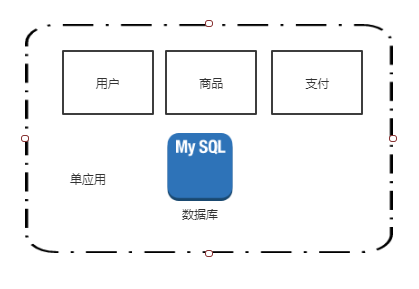
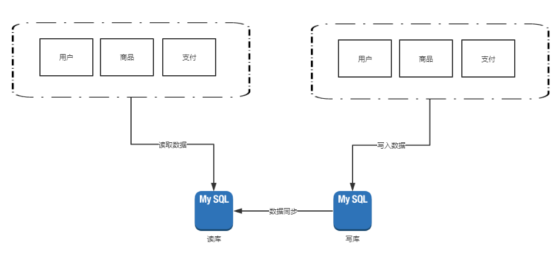
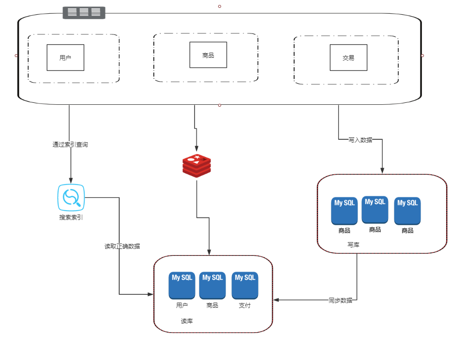

# 认识分布式

## 常见概念

- 单机结构

  - 一个app即可完成所有操作，适用于业务量小的项目

    ```sequence
    食客 --> 厨师 : 点单
    厨师 --> 食客 : 上菜
    ```

    

- 集群结构

  - 多个单机结构的集合

  - 物理上增加额外的机器

    ```sequence
    食客1 --> 厨师1 : 点单
    厨师1 --> 食客1 : 上菜
    
    食客2 --> 厨师2 : 点单
    厨师2 --> 食客2 : 上菜
    ```

    

- 分布式

  - 分布式结构就是将一个完整的系统，按照业务功能，拆分成一个个独立的子系统，在分布式结构中，每个子系统就被称为“服务”。这些子系统能够独立运行在web容器中，它们之间通过RPC方式通信。

  - 操作模式的改变

    ```sequence
    配菜1 --> 厨师1: 洗菜切菜
    配菜2 --> 厨师2: 洗菜切菜
    ```

    

- 节点

  - 可以独立按照分布式协议完成一定逻辑的程序

- 副本机制

  - 在不同节点上持久化同一份数据，当其中一个节点数据丢失，则可以种副本上读取数据
  - 数据副本是分布式系统中解决数据丢失的方法

- 中间件

  - 应用河系统之间为开发者提供通讯处理的一类软件

## 架构演进

- 以电商为例，模块为 `用户`，`商品`，`支付`

### 单应用

- 将整个项目作为整体进行部署

  

### 应用与数据库分离

- 将应用与数据分离至两台服务器上


### 应用集群

- 多个应用服务器

  

### 读写分离

- 两个数据库分别承担读、写 ，写数据库需要向读数据库进行数据提交



### 搜索索引

- 电商场景下 模糊搜索很多，提升搜索的性能使用ES


### 缓存引入

- redis 存储经常使用数据或这其他数据


### 数据库拆分

- 水平拆分：同一个表的数据拆分到更多的表或数据库中
- 垂直拆分：把不同业务数据拆分到不同数据库中，下图：将商品作为业务进行拆分


### 应用拆分

- 将`用户`、`商品`、`交易`拆分成独立应用

