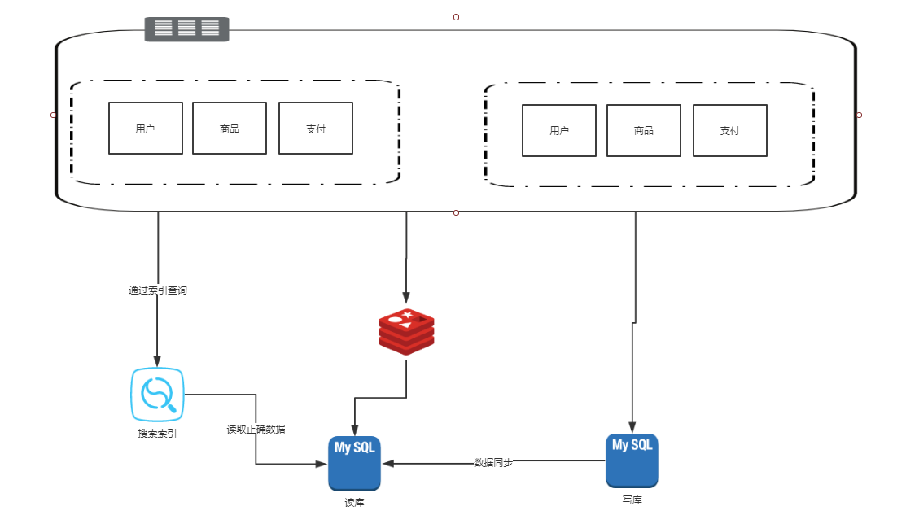

# 认识分布式

## 常见概念

- 单机结构

  - 一个app即可完成所有操作，适用于业务量小的项目

    ```sequence
    食客 --> 厨师 : 点单
    厨师 --> 食客 : 上菜
    ```

    

- 集群结构

  - 多个单机结构的集合

  - 物理上增加额外的机器

    ```sequence
    食客1 --> 厨师1 : 点单
    厨师1 --> 食客1 : 上菜
    
    食客2 --> 厨师2 : 点单
    厨师2 --> 食客2 : 上菜
    ```

    

- 分布式

  - 分布式结构就是将一个完整的系统，按照业务功能，拆分成一个个独立的子系统，在分布式结构中，每个子系统就被称为“服务”。这些子系统能够独立运行在web容器中，它们之间通过RPC方式通信。

  - 操作模式的改变

    ```sequence
    配菜1 --> 厨师1: 洗菜切菜
    配菜2 --> 厨师2: 洗菜切菜
    ```

    

- 节点

  - 可以独立按照分布式协议完成一定逻辑的程序

- 副本机制

  - 在不同节点上持久化同一份数据，当其中一个节点数据丢失，则可以种副本上读取数据
  - 数据副本是分布式系统中解决数据丢失的方法

- 中间件

  - 应用河系统之间为开发者提供通讯处理的一类软件

## 架构演进

- 以电商为例，模块为 `用户`，`商品`，`支付`

### 单应用

- 将整个项目作为整体进行部署

  

### 应用与数据库分离

- 将应用与数据分离至两台服务器上


### 应用集群

- 多个应用服务器

  

### 读写分离

- 两个数据库分别承担读、写 ，写数据库需要向读数据库进行数据提交


### 搜索索引

- 电商场景下 模糊搜索很多，提升搜索的性能使用ES


### 缓存引入

- redis 存储经常使用数据或这其他数据



### 数据库拆分

- 水平拆分：同一个表的数据拆分到更多的表或数据库中
- 垂直拆分：把不同业务数据拆分到不同数据库中，下图：将商品作为业务进行拆分


### 应用拆分

- 将`用户`、`商品`、`交易`拆分成独立应用


## 通讯协议

### TCP/IP

```sequence
发送请求 --> 传输层 :TCP头、http请求报文
传输层 --> 网络层: +IP头
网络层 --> 数据链路层: +MAC头
数据链路层 --> 物理层: 二进制

```

- TCP
  - 目标端口号

- IP
  - 源ip地址
  - 目标ip地址


三次握手

```sequence
服务器A --> 服务器B : SYN/Seq,服务器A：SYN-SEND
服务器B--> 服务器A : SYN/ACK/Seq/ack,服务器B:SYN-RCVD
服务器A-->服务器B: ACK/SEQ: 服务器A、服务器B:esta-bleshed

```

#### 四次挥手

```sequence
服务器A --> 服务器B: FIN=1 关闭连接，服务器A:fin_wait_1
服务器B --> 服务器A: ACK ，服务器B:close_wati,服务器A:fin_wait_2
服务器B --> 服务器A: FIN ,服务器B：last_ack 
服务器A --> 服务器B: ACK,服务器A在接收FIN状态time_wait

```


简单socket

- ClientSocketDemo

```java
public class ClientSocketDemo {

    public static void main(String[] args) throws IOException {
        Socket socket = null;

        try {
            socket = new Socket("127.0.0.1", 8080);
            PrintWriter printWriter = new PrintWriter(socket.getOutputStream(),true);
            printWriter.println("hello");
        } catch (Exception e) {

        } finally {
            if (socket != null) {
                socket.close();
            }
        }
    }
}

```

- ServerSocketDemo

```java
public class ServerSocketDemo {

    public static void main(String[] args) throws IOException {
        ServerSocket serverSocket = null;
        BufferedReader bufferedReader = null;

        try {
            serverSocket = new ServerSocket(8080);
            // 等待客户端连接
            Socket accept = serverSocket.accept();
            // inputstream
            bufferedReader = new BufferedReader(new InputStreamReader(accept.getInputStream()));
            // 写出
            System.out.println(bufferedReader.readLine());

        } catch (IOException e) {
            e.printStackTrace();
        } finally {
            if (bufferedReader != null) {
                bufferedReader.close();
            }

            if (serverSocket != null) {
                serverSocket.close();
            }
        }


    }
}
```

#### 简单UDP

- UdpClientDemo

```java
public class UdpClientDemo {

    public static void main(String[] args) throws Exception {
        InetAddress address = InetAddress.getByName("localhost");
        byte[] sendData = "hello".getBytes();
        DatagramPacket datagramPacket = new DatagramPacket(sendData, sendData.length, address,
                9999);

        DatagramSocket datagramSocket = new DatagramSocket();
        datagramSocket.send(datagramPacket);
        datagramSocket.close();
    }

}
```

- UdpServerDemo

```java
public class UdpServerDemo {

    public static void main(String[] args) {
        DatagramSocket datagramSocket = null;
        DatagramPacket datagramPacket = null;
        try {
            datagramSocket = new DatagramSocket(9999);
            byte[] receiveData = new byte[1024];
            datagramPacket = new DatagramPacket(receiveData, receiveData.length);
            datagramSocket.receive(datagramPacket);

            System.out.println(new String(receiveData, 0, datagramPacket.getLength()));


        } catch (Exception e) {

        } finally {
            if (datagramSocket != null) {
                datagramSocket.close();
            }
        }

    }
}
```

### http

#### 方法

- GET
  - 请求指定的页面信息，并返回实体主体。 
- POST
  - 请求服务器接受所指定的文档作为对所标识的URI的新的从属实体。 
- PUT
  - 从客户端向服务器传送的数据取代指定的文档的内容。 
- DELETE
  -  请求服务器删除指定的页面。 
- OPTIONS
  - 允许客户端查看服务器的性能。
- HEAD
  - 只请求页面的首部。 

#### 特点

1. HTTP无状态

   - 解决技术：cookie + session

     ```sequence
     浏览器--> 服务器:创建一个session，sessionId
     服务器--> 浏览器: 将sessionId 放入cookie
     浏览器--> 服务器: 将cookie 携带发送请求
     ```

2. 数据明文

   - 解决技术：https协议
     - ssl/tls
     - tcp
     - ip


### https

#### 通讯原理

- 基础模型

  客户端向服务端发送一段文本信息。

```sequence
client --> server : 发送一个文本信息
```

- 客户端加密 

  对称加密

  ```sequence
  client+密钥 --> server+密钥: 发送一个文本信息
  ```

  - 对称加密的坏处：一个密钥可以解密所有信息
    ```sequence
    clientA+密钥-->server+密钥:常规请求
    clientB+密钥-->server+密钥:常规请求
    clientC+密钥-->server+密钥:此处可能是一个非法请求
    ```

  - 一个客户端一个密钥
  
    - 问题，客户端如何知道这个密钥
  
    ```sequence
    clientA+密钥A-->server:
    clientB+密钥B-->server:
    clientC+密钥C-->server:
    ```
  
    

- 非对称加密

  - 公钥+私钥
  - 公钥获取形式？

  ```sequence
  clientA+公钥-->server私钥:
  clientB+公钥-->server私钥:
  clientC+公钥-->server私钥:
  ```

  问题概述图

  ```sequence
  client --> 拦截者 : 请求
  拦截者--> server: 转发请求种的公钥
  server--> 拦截者: 公钥+数据
  拦截者--> client: 拦截者创建一个公钥 ， 此时client不知道公钥的正确性
  ```

  

- 第三方加密

  ```sequence
  client --> 拦截者 : 请求
  拦截者--> server: 转发请求种的公钥
  server --> 第三方: server密钥加密公钥
  第三方--> server: 第三方返回加密后的公钥
  server--> 拦截者: 第三方加密公钥+数据
  拦截者--> client: 拦截者创建一个公钥
  ```

  - 第三方创建**数字证书**

    - server公钥(加密后)

  - 问题

    1. 客户端如何解密第三方加密的**数字证书**？

    2. 第三方可以将证书发放给任意一个客户端，如何避免？

       ```sequence
       serverA-->第三方: 申请证书
       serverB-->第三方: 申请证书，这个是一个坏人。这样又可以替换证书了
       ```

- 证书有效性的验证

  - 数字证书改进

    - 证书**唯一编号**

    - 唯一编号算法
    - server公钥(加密后)

    - 其他信息

  ```sequence
  server--> 数字证书A:
  拦截者--> 数字证书B:
  client->> 数字证书A:
  client->> 数字证书B:
  ```

  - 通过加密算法进行一次加密计算，比对加密算法结果和证书唯一编号进行对比是否相等


