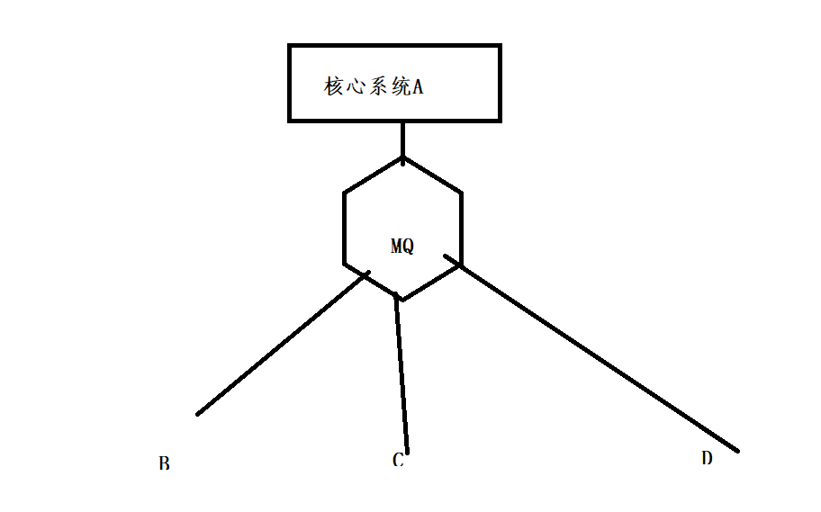

# 消息队列

## 为什么使用消息队列

> 公司有什么业务场景需要使用mq ， 使用mq能带来什么好处
>

### 异步

> 一个插入多个项目多个库，插入SQL执行时间太长了

- 使用mq

一个请求发出只有核心系统A 进行处理，并且发送参数给mq ， 其他系统监听处理数据，只有核心系统A 和 发送消息的一个时长

- MQ 不适合做数据查询

### 解耦

- 注意注意**是否必须同步**

- 未使用

> 核心系统A 
>
> 在A的一个接口中可能需要连续调用多个内部系统的接口
>
> 1. 接口超时如何处理， 重试机制开发
> 2. 调用的内部系统接口挂了如何处理
> 3. 新增额外系统，删除额外系统
>    1. 内部新开发了一个系统，A又要调用
>    2. 内部一个系统下线了不在使用了， A 需要将其调用代码删除

- 使用MQ

> 核心系统A 将数据放入MQ 其他系统进行消费
>
> 新系统订阅MQ 即可
>
> 不需要消息，不消费即可

各个系统进消费

### 消除峰值

> 流量高峰

- 使用mq

用户将请求写入mq ，核心系统A 从mq 一点点处理，每秒处理 当前系统能够处理的最大数量

- MQ 积压数据 ， 不过过了高峰期 写入mq的数量少了，处理的速度还是超过低峰期的数据

> 计算
>
> 假设
>
> 高峰期每秒1000个请求
>
> 系统A 每秒最多500个请求
>
> 高峰期 1个小时
>
> 过了高峰期每秒300个请求
>
> 一个小时积压  1000X1x60x60 - 500x1x60x60 = 1800000
>
> 过了高峰期 还是系统A依旧500每秒的速率消费
>
> 1800000 / 500/1/60/60 = 1 个小时处理完所有的积压数据

核心保证各个系统不挂掉，双十一极为常见

## 消息队列的缺点

### 可用性降低 

1. 各方系统依赖mq 
   1. mq 挂了 ， 生产者消费者无法进行数据处理传递，整体系统崩溃

### 复杂性增加

1. 重复数据如何解决
2. 消息顺序如何解决
3. 消息队列积压处理时间过长
4. 消息丢失如何解决

### 一致性问题

- A返回成功，后面挂着三个系统，其中一个系统处理失败。 用户体验上A成功，后台数据没有完全执行成功。

## kafka 、 rabbitma 、 rocketmq 、activemq

| 特性       | ActiveMQ                                                     | RabbitMQ                                                     | RocketMQ                 | kafka                                                        |
| ---------- | ------------------------------------------------------------ | ------------------------------------------------------------ | ------------------------ | ------------------------------------------------------------ |
| 开发语言   | java                                                         | erlang                                                       | java                     | scala                                                        |
| 单机吞吐量 | 万级                                                         | 万级                                                         | 10万级                   | 10万级                                                       |
| 时效性     | ms级                                                         | us级                                                         | ms级                     | ms级以内                                                     |
| 可用性     | 高(主从架构)                                                 | 高(主从架构)                                                 | 非常高(分布式架构)       | 非常高(分布式架构)                                           |
| 功能特性   | 成熟的产品，在很多公司得到应用；有较多的文档；各种协议支持较好 | 基于erlang开发，所以并发能力很强，性能极其好，延时很低;管理界面较丰富 | MQ功能比较完备，扩展性佳 | 只支持主要的MQ功能，像一些消息查询，消息回溯等功能没有提供，毕竟是为大数据准备的，在大数据领域应用广。 |

- ActiveMQ 社区不怎么活跃
- rabbitMQ 主推，后端管理接棉简单，操作容易，监控等都可以在页面上看到，社区活跃度高

## 消息队列高可用

### rabbit mq

- 集群，不是分布式的

#### 单机模式

- 本地的

#### 普通集群

1. 多台机器多个rabbitMQ 实例
2. 创建一个queue
   1. 分配给其中一台机器 该机器存储 queue 的元数据 + 实际数据
      1. 元数据：配置信息
   2. 集群中其他机器存储 queue 的元数据
3. 消费者消费数据
   1. 消费者请求数据发到了存有元数据+实际数据直接获取数据
   2. 消费者发到了只有queue 元数据的rabbitmq 实例上 ， 这台机器会和真正存有 queue完整信息(元数据 + 实际数据) 进行通讯获取数据

优点： 提高消费方的吞吐量

缺点

1. rabbit mq 集群内部数据传输多
2. 可用性无法保证
   1. queue 的真实存储实例宕机 

#### 镜像集群

- 简单说 每个rabbitmq 实例都包含 queue 的元数据 + 实际数据

- 写入数据的时候同步到每个rabbit mq 实例上

缺点

1. 数据量大磁盘无法容下如何处理
   1. 镜像的时候多个实例同时多个都会产生影响

### kafka

- 分布式

topic + partition 

每个节点存储一部分 topic的数据放入 partition 中

所有的partition 加起来等于 一个topic 中的完整数据

HA 机制 > 0.8 版本 宕机一台机器 数据量缺少 1/ 机器数量

副本机制的出现

每个实例有一个partition 的副本 

- leader 
  - 对外提供读写数据
- follower

消费者写入数据(leader) , leader 同步数据到follower

leader 宕机  follower 选举成为leader

