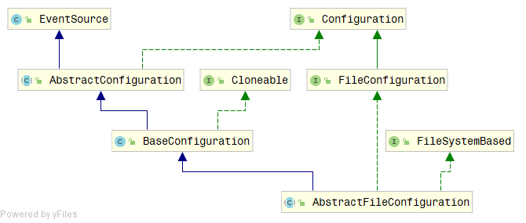
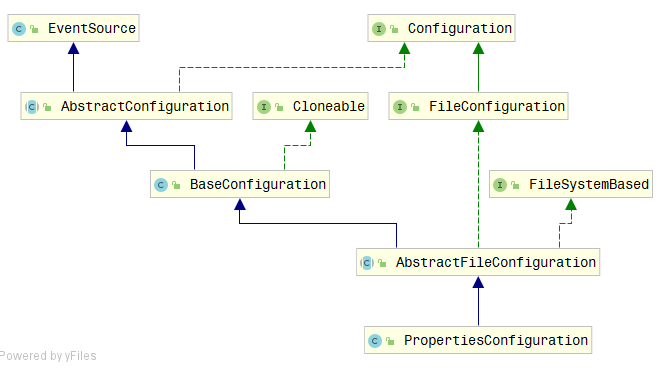
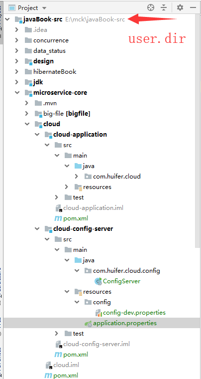

# Spring-Cloud

## 文档

[官方文档](<https://cloud.spring.io/spring-cloud-static/Greenwich.SR1/>)

##  Bootstrap Application Context

- 为了查看bootstrap application context 情况我们使用 `spring-boot-starter-actuator` 进行查看

```xml
    <dependency>
      <groupId>org.springframework.boot</groupId>
      <artifactId>spring-boot-starter-actuator</artifactId>
    </dependency>
```

```properties
spring.application.name=cloud
# web服务端口
server.port=8081
# web 管理端口
management.server.port=9091
# 开放 管理endpoints
management.endpoints.web.exposure.include=*

```

启动一个spring boot 项目

访问<http://localhost:9091/actuator/beans>

```json
{
      "contexts": {
          "application-1":{
              
              ...
              "parentId": "bootstrap"
          },
          "bootstrap":{
               "parentId": null
          }
      }
}
```

- 继承关系
  - bootstrap (父级)
    - application-1(儿子级别)


parent 设置

```java
@SpringBootApplication
@RestController
public class CloudApp {

    @Autowired
    @Qualifier(value = "message")
    private String message;

    public static void main(String[] args) {

        AnnotationConfigApplicationContext context = new AnnotationConfigApplicationContext();
        context.setId("huifer’s context");

        context.registerBean("message", String.class, "this is message");
        context.refresh();

        new SpringApplicationBuilder(CloudApp.class)
                .parent(context)
                .run(args);
    }

    @GetMapping("/index")
    public String index() {
        return message;
    }


}
```


- `org.springframework.boot.builder.SpringApplicationBuilder#parent(org.springframework.context.ConfigurableApplicationContext)`

  ```java
  private ConfigurableApplicationContext context;
  
  public SpringApplicationBuilder parent(ConfigurableApplicationContext parent) {
     this.parent = new SpringApplicationBuilder();
     this.parent.context = parent;
     this.parent.running.set(true);
     return this;
  }
  ```

  - `org.springframework.context.ConfigurableApplicationContext#setParent`

    ```java
    void setParent(@Nullable ApplicationContext parent);
    ```

    
    - `org.springframework.context.support.AbstractApplicationContext#setParent`

      ```java
      @Override
      public void setParent(@Nullable ApplicationContext parent) {
         this.parent = parent;
         if (parent != null) {
            Environment parentEnvironment = parent.getEnvironment();
            if (parentEnvironment instanceof ConfigurableEnvironment) {
               getEnvironment().merge((ConfigurableEnvironment) parentEnvironment);
            }
         }
      }
      ```

## 配置

- `java.util.Properties` 

  - 该类通常获取`String`类型的键值对

  - ```java
    public class Properties extends Hashtable<Object,Object> {}
    ```

    继承`hashtable` 事实上可以存储`object`类型

- `org.apache.commons.configuration.Configuration`

  - `getBigDecimal`
  - `getBigInteger`
  - 它可以做到将文本信息转换成具体的对应类型，提供一个类型转换


- `org.apache.commons.configuration.PropertiesConfiguration`



- `org.apache.commons.configuration.XMLPropertiesConfiguration`



顶层接口都有`org.apache.commons.configuration.Configuration` 补充了转换的功能。


## 配置源

1. http
2. git
3. jdbc
4. file


## spring 配置源

- `org.springframework.core.env.Environment`

  - `org.springframework.core.env.ConfigurableEnvironment`

    - `org.springframework.core.env.MutablePropertySources`

      - `org.springframework.core.env.PropertySource`

        - `org.springframework.core.env.MapPropertySource`

        - `org.springframework.core.env.PropertiesPropertySource`

          


## spring cloud config 

- 服务端依赖

```java
<dependency>
  <groupId>org.springframework.cloud</groupId>
  <artifactId>spring-cloud-config-server</artifactId>
</dependency>
```

- 启动项

  ```java
  @SpringBootApplication
  @EnableConfigServer
  public class ConfigServer {
  
      public static void main(String[] args) {
          SpringApplication.run(ConfigServer.class, args);
      }
  
  }
  ```

- 服务配置项

  ```properties
  spring.application.name=cloud-config-server
  
  
  server.port=9090
  spring.cloud.config.server.git.uri=\
    ${user.dir}/microservice-core/cloud/cloud-config-server/src/main/resources/config
  ```

  - 其他配置

    ```properties
    name=huifer
    ```

  
  - `config-dev.properties`

    - ```properties
      name=huifer
      ```

  - `config-test.properties`

    - ```properties
      type=git
      ```

- 提交配置文件

  - ```
    cd resources\config
    git init 
    git add *.properties
    git add -m "add config"
    ```

- 启动项目 + 访问

  - http://localhost:9090/config/test

  ```json
  // http://localhost:9090/config/test
  
  {
    "name": "config",
    "profiles": [
      "test"
    ],
    "label": null,
    "version": "d4c78fd3d0a04e1722b2198ff0ba0362ff6102e5",
    "state": null,
    "propertySources": [
      {
        "name": "E:\\mck\\javaBook-src/microservice-core/cloud/cloud-config-server/src/main/resources/config/config-test.properties",
        "source": {
          "type": "git"
        }
      }
    ]
  }
  ```

  

  - <http://localhost:9090/config/dev>

    ```json
    // http://localhost:9090/config/dev
    
    {
      "name": "config",
      "profiles": [
        "dev"
      ],
      "label": null,
      "version": "d4c78fd3d0a04e1722b2198ff0ba0362ff6102e5",
      "state": null,
      "propertySources": [
        {
          "name": "E:\\mck\\javaBook-src/microservice-core/cloud/cloud-config-server/src/main/resources/config/config-dev.properties",
          "source": {
            "name": "huifer"
          }
        }
      ]
    }
    ```

    

----

