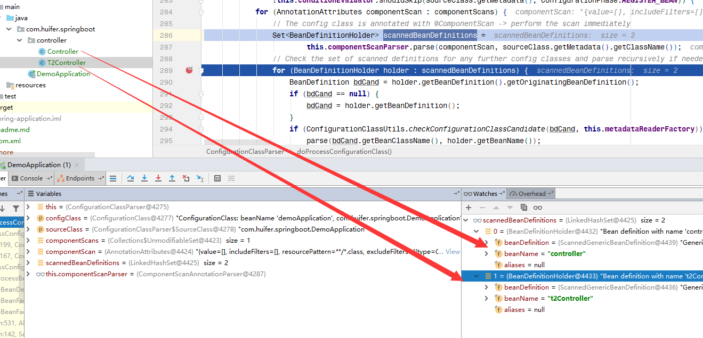

# Spring
## `@SpringBootApplication`
```java
@SpringBootConfiguration
@EnableAutoConfiguration
@ComponentScan(excludeFilters = {
		@Filter(type = FilterType.CUSTOM, classes = TypeExcludeFilter.class),
		@Filter(type = FilterType.CUSTOM,
				classes = AutoConfigurationExcludeFilter.class) })
}
```

- `@ComponentScan` :扫描Beans

- `@EnableAutoConfiguration`:激活自动装配

- `@SpringBootConfiguration`: 等价`@Configuration` 配置注解

  ```java
  @Configuration
  public @interface SpringBootConfiguration {
  }
  ```


## `@Commont `相关

- `@Commont`
  - `@Controller`
  
    ```java
    @Component
    public @interface Controller {
        @AliasFor(
            annotation = Component.class
        )
        String value() default "";
    }
    ```
  
  - `@Service`
  
    ```java
    @Component
    public @interface Service {
        @AliasFor(
            annotation = Component.class
        )
        String value() default "";
    }
    ```
  
  - `@Repository`
  
    ```java
    @Component
    public @interface Repository {
        @AliasFor(
            annotation = Component.class
        )
        String value() default "";
    }
    ```
  
  - `@Configuration`
  
    ```java
    @Component
    public @interface Configuration {
        @AliasFor(
            annotation = Component.class
        )
        String value() default "";
    }
    ```
  
  - 这些注解均与`@Component`有关 ，都被它注解
  
- `@ComponentScan `扫描所有被 `@Component`注解的类


### 处理流程

- `org.springframework.context.annotation.ConfigurationClassParser`

  ```java
  @Nullable
  protected final SourceClass doProcessConfigurationClass(ConfigurationClass configClass, SourceClass sourceClass)
        throws IOException {
  ...
  
            
            // 这部分内容进行扫描获得所有@Component注解
           Set&lt;BeanDefinitionHolder&gt; scannedBeanDefinitions =
                 this.componentScanParser.parse(componentScan, sourceClass.getMetadata().getClassName());
           // Check the set of scanned definitions for any further config classes and parse recursively if needed
           for (BeanDefinitionHolder holder : scannedBeanDefinitions) {
              BeanDefinition bdCand = holder.getBeanDefinition().getOriginatingBeanDefinition();
              if (bdCand == null) {
                 bdCand = holder.getBeanDefinition();
              }
              if (ConfigurationClassUtils.checkConfigurationClassCandidate(bdCand, this.metadataReaderFactory)) {
                 parse(bdCand.getBeanClassName(), holder.getBeanName());
              }
           }
        }
     }
  
    ...
  }-
  ```
  - ` org.springframework.context.annotation.ComponentScanAnnotationParser#parse`

    ```java
    public Set<BeanDefinitionHolder> parse(AnnotationAttributes componentScan, final String declaringClass) {
        		ClassPathBeanDefinitionScanner scanner = new ClassPathBeanDefinitionScanner(this.registry,
    				componentScan.getBoolean("useDefaultFilters"), this.environment, this.resourceLoader);
    
        ...
    }
    ```

    - `org.springframework.context.annotation.ClassPathBeanDefinitionScanner#ClassPathBeanDefinitionScanner(org.springframework.beans.factory.support.BeanDefinitionRegistry, boolean, org.springframework.core.env.Environment, org.springframework.core.io.ResourceLoader)`

      ```java
      public ClassPathBeanDefinitionScanner(BeanDefinitionRegistry registry, boolean useDefaultFilters,
            Environment environment, @Nullable ResourceLoader resourceLoader) {
      
         Assert.notNull(registry, "BeanDefinitionRegistry must not be null");
         this.registry = registry;
      
         if (useDefaultFilters) {
             // 调用父类的注册方法 ClassPathScanningCandidateComponentProvider
            registerDefaultFilters();
         }
         setEnvironment(environment);
         setResourceLoader(resourceLoader);
      }
      ```

      - `org.springframework.context.annotation.ClassPathScanningCandidateComponentProvider`

        ```java
        @SuppressWarnings("unchecked")
        protected void registerDefaultFilters() {
           this.includeFilters.add(new AnnotationTypeFilter(Component.class));
           ClassLoader cl = ClassPathScanningCandidateComponentProvider.class.getClassLoader();
           try {
              this.includeFilters.add(new AnnotationTypeFilter(
                    ((Class<? extends Annotation>) ClassUtils.forName("javax.annotation.ManagedBean", cl)), false));
              logger.trace("JSR-250 'javax.annotation.ManagedBean' found and supported for component scanning");
           }
           catch (ClassNotFoundException ex) {
              // JSR-250 1.1 API (as included in Java EE 6) not available - simply skip.
           }
           try {
              this.includeFilters.add(new AnnotationTypeFilter(
                    ((Class<? extends Annotation>) ClassUtils.forName("javax.inject.Named", cl)), false));
              logger.trace("JSR-330 'javax.inject.Named' annotation found and supported for component scanning");
           }
           catch (ClassNotFoundException ex) {
              // JSR-330 API not available - simply skip.
           }
        }
        ```


​							


### 如何获取beans

```java
package com.huifer.spring;

import java.util.Arrays;
import org.springframework.boot.CommandLineRunner;
import org.springframework.boot.SpringApplication;
import org.springframework.boot.autoconfigure.SpringBootApplication;
import org.springframework.context.ApplicationContext;
import org.springframework.context.annotation.Bean;

/**
 * <p>Title : DemoApplication </p>
 * <p>Description : </p>
 *
 * @author huifer
 * @date 2019-05-22
 */
@SpringBootApplication
public class DemoApplication {

    public static void main(String[] args) {
        SpringApplication.run(DemoApplication.class, args);
    }

    @Bean
    public CommandLineRunner run(ApplicationContext appContext) {
        return args -> {

            String[] beans = appContext.getBeanDefinitionNames();
            Arrays.stream(beans).sorted().forEach(System.out::println);

        };
    }

}
```


---

## `@SpringBootApplication`相关

### 层级关系

- `@SpringBootApplication`
  - `@SpringBootConfiguration`
    - `@Configuration`
      - `@Component`
- `@EnableAutoConfiguration`
  - `@AutoConfigurationPackage`
- `@ComponentScan`


## Spring注解驱动

- `org.springframework.context.annotation.AnnotationConfigApplicationContext`

  一个简单的Spring注解驱动案例

  ```java
  public class SpringAnnotationDemo {
  
      public static void main(String[] args) {
          AnnotationConfigApplicationContext context = new AnnotationConfigApplicationContext();
          context.register(SpringAnnotationDemo.class);
          context.refresh();
  
          System.out.println(
                  context.getBean("filterRegistrationBean")
          );
  
      }
  
      @Bean
      public String filterRegistrationBean() {
          return "张三";
      }
  }
  ```

  - 输出`张三`


## Spring 事件

- Spring 事件类型`org.springframework.context.ApplicationEvent`

- Spring 事件监听器 `org.springframework.context.ApplicationListener`

- Spring 事件广播器 `org.springframework.context.event.ApplicationEventMulticaster`

  ```java
  public class ApplicationEventDemo {
  
      public static void main(String[] args) {
  
          ApplicationEventMulticaster multicaster = new SimpleApplicationEventMulticaster();
          // 监听事件
          multicaster.addApplicationListener(new ApplicationListener<ApplicationEvent>() {
              @Override
              public void onApplicationEvent(ApplicationEvent event) {
                  System.out.println("事件:" + event.getSource());
              }
          });
  
          // 发布事件
          multicaster.multicastEvent(new MyEvent("java"));
          multicaster.multicastEvent(new PayloadApplicationEvent<Object>("python", "python"));
      }
  
      private static class MyEvent extends ApplicationEvent {
  
          public MyEvent(Object source) {
              super(source);
          }
      }
  
  
  }
  ```


