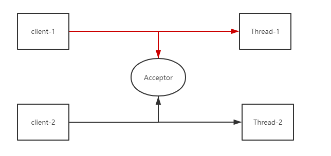
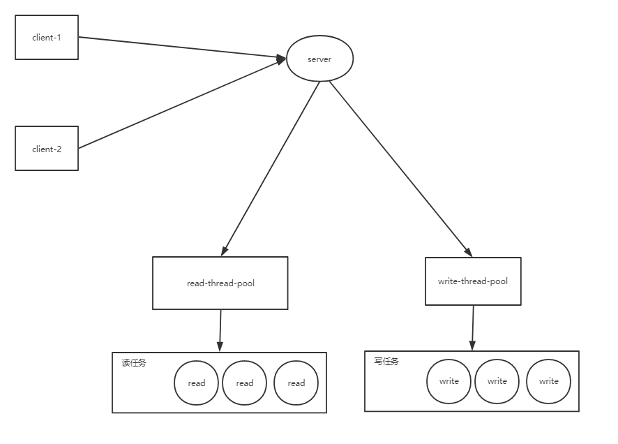

# Netty

## Netty是什么

> Netty is *an asynchronous event-driven network application framework* 
> for rapid development of maintainable high performance protocol servers & clients.

- 异步，事件驱动框架


## BIO/NIO/AIO

### BIO

#### 1:1同步阻塞IO模型




#### M:N同步阻塞IO模型


> 同步并阻塞，服务器实现模式为一个连接一个线程，即客户端有连接请求时服务器端就需要启动一个线程进行处理，如果这个连接不做任何事情会造成不必要的线程开销，当然可以通过线程池机制改善。


- 应用场景：适用于连接数目比较小且固定的架构，这种方式对服务器资源要求比较高，并发局限于应用中

### NIO


> 同步非阻塞，服务器实现模式为一个请求一个线程，即客户端发送的连接请求都会注册到多路复用器上，多路复用器轮询到连接有I/O请求时才启动一个线程进行处理。

- 应用场景：适用于连接数目多且连接比较短（轻操作）的架构，比如聊天服务器，并发局限于应用中，编程比较复杂

### AIO



> 异步非阻塞，服务器实现模式为一个有效请求一个线程，客户端的I/O请求都是由OS先完成了再通知服务器应用去启动线程进行处理，

- 应用场景：适用于连接数目多且连接比较长（重操作）的架构，比如相册服务器，充分调用OS参与并发操作，编程比较复杂


## FileChannel

> ​	**Java NIO FileChannel是连接文件的通道。使用FileChannel，您可以从文件中读取数据和将数据写入文件。Java NIO FileChannel类是NIO用于替代使用标准Java IO API读取文件的方法。**

- 开启
  - 不能直接开启，需要通过`InputStream`，`OutputStream`获取
  - `java.io.FileOutputStream#getChannel`
- 读取
  - `java.nio.channels.FileChannel#read(java.nio.ByteBuffer)`
- 写入
  - `java.nio.channels.FileChannel#write(java.nio.ByteBuffer)`
- 关闭
  - `java.nio.channels.spi.AbstractInterruptibleChannel#close`
- 大小
  - 返回通道连接到的文件的文件大小。
  - `java.nio.channels.FileChannel#size`
- 位置
  - 对`FileChannel`进行读取或写入时，你会在特定的位置上这样做。您可以通过调用`FileChannel#position()`方法来获取对象的当前位置。还可以通过调用FileChannel的`position(long pos)`方法设置位置。
  - `java.nio.channels.FileChannel#position()`
- 截断
  - 可以通过调用该`FileChannel的truncate()`方法来截断文件。当您截断文件时，您可以在给定的长度上将其截断。
  - `java.nio.channels.FileChannel#truncate`

```java
public class FileChannelDemo {

    public static void main(String[] args) throws IOException {
        File file = new File("E:\\mck\\javaBook-src\\netty\\src\\main\\resources\\data.data");
        if (!file.exists()) {
            file.createNewFile();
        }
        FileOutputStream fos = new FileOutputStream(file);
        FileChannel fc = fos.getChannel();

        ByteBuffer byteBuffer = ByteBuffer.allocate(1024);
        byteBuffer.put("hello , fileChannel\n".getBytes(StandardCharsets.UTF_8));

        byteBuffer.flip();
        fc.write(byteBuffer);
        byteBuffer.clear();

        byteBuffer.clear();
        fos.close();
        fc.close();


    }
}
```


## Selector

> ​	**Selector 一般称 为选择器 （或 多路复用器） 。它是Java NIO核心组件中的一个，用于检查一个或多个NIO Channel（通道）的状态是否处于可读、可写。可以实现单线程管理多个channels,也就是说可以管理多个网络连接。**

- 开启

  - `java.nio.channels.Selector#open`

- channel 注册

  - ```java
    channel.configureBlocking(false);
    SelectionKey key = channel.register(selector, Selectionkey.OP_READ);
    ```

  channel必须是非阻塞的

- `java.nio.channels.SelectionKey`

  1. `java.nio.channels.SelectionKey#OP_READ` 读事件
  2. `java.nio.channels.SelectionKey#OP_WRITE`写事件
  3. `java.nio.channels.SelectionKey#OP_CONNECT`连接事件
  4. `java.nio.channels.SelectionKey#OP_ACCEPT`确认事件

- 停止选择

  - `java.nio.channels.Selector#wakeup`

    通过调用Selector对象的wakeup（）方法让处在阻塞状态的select()方法立刻返回 
    该方法使得选择器上的第一个还没有返回的选择操作立即返回。如果当前没有进行中的选择操作，那么下一次对select()方法的一次调用将立即返回。

  - `java.nio.channels.Selector#close`

    该方法使得任何一个在选择操作中阻塞的线程都被唤醒（类似`wakeup()`），同时使得注册到该Selector的所有Channel被注销，所有的键将被取消，但是Channel本身并不会关闭。

